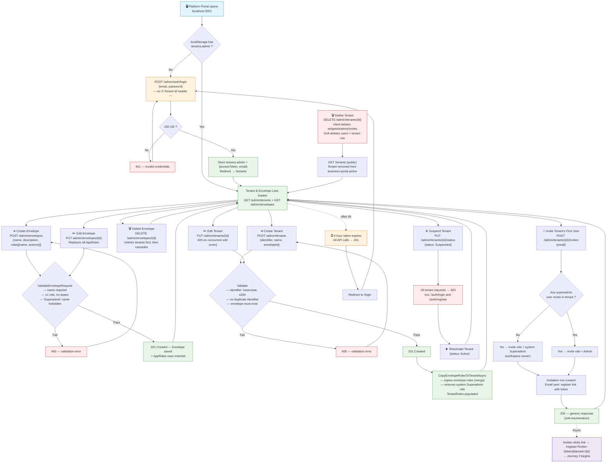

# Tessera — User Journey Diagrams

> Visual companion to `CODE_DRY_RUN.md`. Three separate flowcharts for the
> three actor types in the system.

---

## 1. Platform Admin (Superadmin) — Platform Portal `:3001`

The platform admin operates outside any tenant. They manage the global
configuration: envelopes (role templates), tenants, and first-user invitations.



---

## 2. Tenant Admin (Workspace Superadmin / Admin) — Business Portal `:3000`

The first user to redeem a platform invite becomes the workspace **Superadmin**
(system role, all actions). They can manage team members, roles, and widgets.

```mermaid
flowchart TD
    Start["🌐 Business Portal opens<br/>localhost:3000"]
    AuthCheck{"localStorage has<br/>tessera.auth ?"}
    Login["POST /auth/login<br/>{email, password}<br/>+ X-Tenant-Id: {tenant-identifier}"]
    LoginOk{"200 OK ?"}
    MfaRequired{"MfaEnabled ?"}
    MfaStep["POST /auth/mfa<br/>{mfaToken, code: 6-digit TOTP}"]
    MfaOk{"200 OK ?"}
    LoginFail["401 — invalid credentials or rate limited (429)"]
    StoreTokens["Store tessera.auth = {accessToken, refreshToken, tenantId, email}<br/>Redirect → /dashboard"]
    RateLimit["POST /auth/* rate limited<br/>20 requests / 60s / IP"]

    %% Dashboard load
    Dashboard["/dashboard loads"]
    Parallel["Parallel requests:<br/>GET /tenant/me + GET /widgets"]
    MeResponse["GET /tenant/me → {email, role, actions[], tenantId}"]
    WidgetList["GET /widgets → tenant-scoped widget list"]
    RenderDashboard["Render dashboard with action-based UI pills"]

    %% Widget CRUD
    CreateWidget["➕ POST /widgets<br/>{name, description}<br/>Action: create_widget"]
    EditWidget["✏️ PUT /widgets/{id}<br/>{name, description}<br/>Action: edit_widget"]
    DeleteWidget["🗑️ DELETE /widgets/{id}<br/>Action: delete_widget"]
    WidgetActionCheck{"ActionChecks.RequiresAsync<br/>— IsSystem role → all pass<br/>— Otherwise: role.actions contains action ?"}
    Widget403["403 — 'You are not authorized'"]
    Widget201["201 Created"]
    Widget204["204 No Content"]

    %% Team management
    TeamNav{"Role includes<br/>manage_users ?"}
    TeamPage["/dashboard/users — Team Page"]
    ListUsers["GET /tenant/users<br/>→ user list with roles"]
    AddUser["➕ Direct add teammate<br/>POST /tenant/users<br/>{email, password ≥8, roleId}<br/>EmailVerified = true"]
    InviteTeammate["📩 Invite teammate<br/>POST /tenant/invites<br/>{email, roleId}<br/>Email sent with register link"]
    ChangeUserRole["🔄 Change role<br/>PUT /tenant/users/{id}<br/>{roleId}<br/>TokenVersion++ → all sessions revoked"]
    RemoveUser["🚫 Remove user<br/>DELETE /tenant/users/{id}<br/>IsDeleted=true, TokenVersion++<br/>All refresh tokens revoked"]
    SelfGuard{"Trying to change<br/>own role or remove self ?"}
    SelfReject["400 — 'Cannot change your own role'<br/>or 'Cannot remove yourself'"]
    SystemGuard{"Target holds system<br/>Superadmin role ?"}
    SystemReject["400 — 'Platform-managed,<br/>cannot be changed'"]

    %% Role management
    ListRoles["GET /tenant/roles<br/>→ workspace role list"]
    CreateRole["➕ Create role<br/>POST /tenant/roles<br/>{name, actions}<br/>Actions validated vs ActionCatalog"]
    EditRole["✏️ Edit role<br/>PUT /tenant/roles/{id}<br/>IsSystem roles → 400"]
    DeleteRole["🗑️ Delete role<br/>DELETE /tenant/roles/{id]<br/>IsSystem → 400<br/>Users assigned → 400 'reassign first'"]
    RoleGuard{"Role is IsSystem ?"}
    RoleReject["400 — managed by platform"]
    UsersGuard{"Users hold this role ?"}
    UsersReject["400 — 'Reassign them first'"]

    %% Password & sessions
    ChangePassword["POST /auth/change-password<br/>{currentPassword, newPassword ≥8}<br/>TokenVersion++ → all sessions die"]
    ForgotPassword["POST /auth/forgot-password<br/>{email} → reset email"]
    ResetPassword["POST /auth/reset-password<br/>{token, newPassword ≥8}"]
    EnrollMfa["POST /auth/mfa/enroll → secret + otpauth URI<br/>POST /auth/mfa/verify → TOTP validated<br/>MfaEnabled = true, TokenVersion++"]
    DisableMfa["POST /auth/mfa/disable<br/>{code} — TOTP verified"]
    Logout["Clear localStorage → redirect /login"]

    %% Token refresh
    AutoRefresh["401 from API → auto-refresh<br/>POST /auth/refresh {refreshToken}<br/>→ new accessToken → retry request once"]
    RefreshFail["Refresh fails → logout → /login"]

    Start --> AuthCheck
    AuthCheck -- "No" --> Login
    AuthCheck -- "Yes" --> Dashboard
    Login --> LoginOk
    LoginOk -- "Fail" --> LoginFail --> Login
    LoginOk -- "OK" --> MfaRequired
    MfaRequired -- "Yes" --> MfaStep --> MfaOk
    MfaOk -- "Fail" --> LoginFail
    MfaOk -- "OK" --> StoreTokens --> Dashboard
    MfaRequired -- "No" --> StoreTokens
    Login -. "Excess" .-> RateLimit

    Dashboard --> Parallel --> MeResponse --> RenderDashboard
    Parallel --> WidgetList --> RenderDashboard

    RenderDashboard --> CreateWidget
    RenderDashboard --> EditWidget
    RenderDashboard --> DeleteWidget
    RenderDashboard --> TeamNav
    RenderDashboard --> ListRoles

    CreateWidget --> WidgetActionCheck
    EditWidget --> WidgetActionCheck
    DeleteWidget --> WidgetActionCheck
    WidgetActionCheck -- "Denied" --> Widget403
    WidgetActionCheck -- "Allowed" --> Widget201
    WidgetActionCheck -- "Allowed" --> Widget204

    TeamNav -- "Yes" --> TeamPage --> ListUsers
    TeamPage --> AddUser
    TeamPage --> InviteTeammate
    TeamPage --> ChangeUserRole
    TeamPage --> RemoveUser

    AddUser --> WidgetActionCheck
    InviteTeammate --> WidgetActionCheck
    ChangeUserRole --> SelfGuard
    SelfGuard -- "Yes" --> SelfReject
    SelfGuard -- "No" --> SystemGuard
    SystemGuard -- "Yes" --> SystemReject
    SystemGuard -- "No" --> WidgetActionCheck
    RemoveUser --> SelfGuard

    ListRoles --> CreateRole
    ListRoles --> EditRole
    ListRoles --> DeleteRole
    CreateRole --> WidgetActionCheck
    EditRole --> RoleGuard
    RoleGuard -- "Yes" --> RoleReject
    RoleGuard -- "No" --> WidgetActionCheck
    DeleteRole --> RoleGuard
    DeleteRole --> UsersGuard
    UsersGuard -- "Yes" --> UsersReject
    UsersGuard -- "No" --> WidgetActionCheck

    RenderDashboard --> ChangePassword
    RenderDashboard --> ForgotPassword --> ResetPassword
    RenderDashboard --> EnrollMfa
    RenderDashboard --> DisableMfa
    RenderDashboard --> Logout

    RenderDashboard -. "401" .-> AutoRefresh
    AutoRefresh -- "Fail" .-> RefreshFail

    style Start fill:#e1f5fe,stroke:#0288d1
    style Login fill:#fff3e0,stroke:#f57c00
    style StoreTokens fill:#e8f5e9,stroke:#388e3c
    style Dashboard fill:#e8f5e9,stroke:#388e3c
    style RenderDashboard fill:#e8f5e9,stroke:#388e3c
    style Widget201 fill:#e8f5e9,stroke:#388e3c
    style Widget204 fill:#e8f5e9,stroke:#388e3c
    style Widget403 fill:#ffebee,stroke:#c62828
    style LoginFail fill:#ffebee,stroke:#c62828
    style SelfReject fill:#ffebee,stroke:#c62828
    style SystemReject fill:#ffebee,stroke:#c62828
    style RoleReject fill:#ffebee,stroke:#c62828
    style UsersReject fill:#ffebee,stroke:#c62828
    style RateLimit fill:#ffebee,stroke:#c62828
    style RefreshFail fill:#ffebee,stroke:#c62828
```

---

## 3. Tenant User (Manager / User / Viewer) — Business Portal `:3000`

Regular tenant users are invited by their workspace admin. Their permissions
depend entirely on the **actions** assigned to their role.

```mermaid
flowchart TD
    Start["🌐 Business Portal opens<br/>localhost:3000"]
    AuthCheck{"localStorage has<br/>tessera.auth ?"}
    Login["POST /auth/login<br/>{email, password}<br/>+ X-Tenant-Id: {tenant-identifier}"]
    LoginOk{"200 OK ?"}
    MfaRequired{"MfaEnabled ?"}
    MfaStep["POST /auth/mfa<br/>{mfaToken, code: 6-digit TOTP}"]
    MfaOk{"200 OK ?"}
    LoginFail["401 — invalid credentials<br/>or 429 — rate limited (20/min/IP)"]
    StoreTokens["Store tessera.auth<br/>Redirect → /dashboard"]

    %% Registration via invite
    InviteLink["📩 Click invite link<br/>/register?invite={token}&tenant={id}"]
    Register["POST /auth/register<br/>{email, password, inviteToken}<br/>+ X-Tenant-Id: {tenant-identifier}"]
    RegisterOk{"201 Created ?"}
    RegisterFail["400 — 'Registration failed'<br/>(generic, anti-enumeration)"]
    FirstUser{"Workspace has a<br/>Superadmin user ?"}
    FirstUserYes["Yes → invite role assigned<br/>(Admin, User, etc.)"]
    FirstUserNo["No → becomes Superadmin<br/>(workspace owner)"]
    RoleGranted["User created with RoleId<br/>EmailVerified = true"]
    WelcomeTokens["201 + JWT tokens<br/>Stored → /dashboard"]

    %% Dashboard
    Dashboard["/dashboard loads"]
    Parallel["Parallel:<br/>GET /tenant/me + GET /widgets"]
    MeResponse["GET /tenant/me<br/>{email, role, actions[], tenantId}"]
    WidgetList["GET /widgets<br/>→ tenant-scoped widget list"]
    RenderUI["Render dashboard based on actions[]"]

    %% Role-based UI rendering
    RoleDecision{"Role's actions ?"}
    ViewOnly[/"view_widgets only<br/>— read-only widget list<br/>— hint: 'Your role is view-only'"/]
    CanCreate[/"create_widget<br/>— + create button visible"/]
    CanEdit[/"create_widget + edit_widget<br/>— + edit button on each row"/]
    CanDelete[/"+ delete_widget<br/>— + delete button on each row"/]
    CanManage[/"manage_users<br/>— Team nav visible<br/>— can invite/add/edit/remove users"/]

    %% Widget actions
    CreateWidget["➕ POST /widgets<br/>{name, description}<br/>Action: create_widget"]
    EditWidget["✏️ PUT /widgets/{id}<br/>{name, description}<br/>Action: edit_widget"]
    DeleteWidget["🗑️ DELETE /widgets/{id}<br/>Action: delete_widget"]
    ActionCheck{"ActionChecks.RequiresAsync<br/>— role.actions contains action ?"}
    Allowed["✅ 201/204"]
    Denied["❌ 403 — 'Not authorized'"]

    %% Self-service
    ChangePassword["POST /auth/change-password<br/>{currentPassword, newPassword ≥8}<br/>All sessions die → re-login"]
    ForgotPassword["POST /auth/forgot-password<br/>{email} → generic response"]
    ResetPassword["POST /auth/reset-password<br/>{token, newPassword ≥8}"]
    EnrollMfa["POST /auth/mfa/enroll → TOTP secret<br/>POST /auth/mfa/verify → validate code<br/>MfaEnabled = true"]
    DisableMfa["POST /auth/mfa/disable<br/>{code} → MfaEnabled = false"]
    Logout["Clear localStorage → /login"]

    %% Token refresh
    AutoRefresh["401 → auto-refresh<br/>POST /auth/refresh<br/>→ new token → retry once"]
    RefreshFail["Refresh fails → logout → /login"]

    Start --> AuthCheck
    AuthCheck -- "No" --> Login
    AuthCheck -- "Yes" --> Dashboard
    Login --> LoginOk
    LoginOk -- "Fail" --> LoginFail --> Login
    LoginOk -- "OK" --> MfaRequired
    MfaRequired -- "Yes" --> MfaStep --> MfaOk
    MfaOk -- "Fail" --> LoginFail
    MfaOk -- "OK" --> StoreTokens --> Dashboard
    MfaRequired -- "No" --> StoreTokens

    Start -. "Via invite link" .-> InviteLink --> Register --> RegisterOk
    RegisterOk -- "Fail" --> RegisterFail
    RegisterOk -- "OK" --> FirstUser
    FirstUser -- "No (first)" --> FirstUserNo --> RoleGranted
    FirstUser -- "Yes" --> FirstUserYes --> RoleGranted
    RoleGranted --> WelcomeTokens --> Dashboard

    Dashboard --> Parallel --> MeResponse --> RenderUI
    Parallel --> WidgetList --> RenderUI

    RenderUI --> RoleDecision
    RoleDecision -- "view_widgets" --> ViewOnly
    RoleDecision -- "create_widget" --> CanCreate
    RoleDecision -- "+ edit_widget" --> CanEdit
    RoleDecision -- "+ delete_widget" --> CanDelete
    RoleDecision -- "+ manage_users" --> CanManage

    CanCreate --> CreateWidget
    CanEdit --> EditWidget
    CanDelete --> DeleteWidget
    CreateWidget --> ActionCheck
    EditWidget --> ActionCheck
    DeleteWidget --> ActionCheck
    ActionCheck -- "Allowed" --> Allowed
    ActionCheck -- "Denied" --> Denied

    RenderUI --> ChangePassword
    RenderUI --> ForgotPassword --> ResetPassword
    RenderUI --> EnrollMfa
    RenderUI --> DisableMfa
    RenderUI --> Logout

    RenderUI -. "401" .-> AutoRefresh
    AutoRefresh -- "Fail" .-> RefreshFail

    style Start fill:#e1f5fe,stroke:#0288d1
    style Login fill:#fff3e0,stroke:#f57c00
    style StoreTokens fill:#e8f5e9,stroke:#388e3c
    style Dashboard fill:#e8f5e9,stroke:#388e3c
    style RenderUI fill:#e8f5e9,stroke:#388e3c
    style Allowed fill:#e8f5e9,stroke:#388e3c
    style ViewOnly fill:#f3e5f5,stroke:#7b1fa2
    style CanCreate fill:#e8f5e9,stroke:#388e3c
    style CanEdit fill:#e8f5e9,stroke:#388e3c
    style CanDelete fill:#e8f5e9,stroke:#388e3c
    style CanManage fill:#e8f5e9,stroke:#388e3c
    style LoginFail fill:#ffebee,stroke:#c62828
    style Denied fill:#ffebee,stroke:#c62828
    style RegisterFail fill:#ffebee,stroke:#c62828
    style RefreshFail fill:#ffebee,stroke:#c62828
    style RoleGranted fill:#e8f5e9,stroke:#388e3c
    style WelcomeTokens fill:#e8f5e9,stroke:#388e3c
```

---

## Quick Reference — The Pipeline All Requests Share

Every HTTP request into the Platform API passes through this middleware stack
(defined in `Program.cs`). The three diagrams above are all downstream of it.

```mermaid
flowchart LR
    Request["Incoming Request"] --> G1["1. HTTPS Redirect"]
    G1 --> G2["2. Exception Handler"]
    G2 --> G3["3. Request Logger"]
    G3 --> G4["4. CORS"]
    G4 --> G5["5. Rate Limiter<br/>(/auth → 20/min/IP)"]
    G5 --> G6["6. Tenant Validation<br/>X-Tenant-Id required<br/>(skip: /health, /openapi,<br/>/admin, /tenants)"]
    G6 --> G7["7. Finbuckle MultiTenant<br/>Resolve tenant from header"]
    G7 --> G8["8. Tenant Suspension<br/>403 if Suspended<br/>(skip: /health, /ready,<br/>/openapi, /admin, /tenants)"]
    G8 --> G9["9. Authentication<br/>JwtBearer decode"]
    G9 --> G10["10. Tenant Claim Check<br/>403 if token.tenant ≠ header<br/>(superadmin tokens: no claim → skip)"]
    G10 --> G11["11. Token Version Check<br/>401 if version mismatch<br/>(skip: /auth/login, /register,<br/>/refresh, /logout, etc.)"]
    G11 --> G12["12. Authorization<br/>SuperAdminOnly on /admin<br/>RequireAuthorization elsewhere"]
    G12 --> G13["13. Endpoint + ActionChecks<br/>Fine-grained per action"]
    G13 --> Response["Response"]

    style Request fill:#e1f5fe,stroke:#0288d1
    style Response fill:#e8f5e9,stroke:#388e3c
    style G6 fill:#fff3e0,stroke:#f57c00
    style G8 fill:#fff3e0,stroke:#f57c00
    style G10 fill:#fff3e0,stroke:#f57c00
    style G11 fill:#fff3e0,stroke:#f57c00
    style G12 fill:#fff3e0,stroke:#f57c00
    style G13 fill:#e8f5e9,stroke:#388e3c
```



---

*Generated from `CODE_DRY_RUN.md` (branch `tessera/mcp`). Every endpoint,
middleware, and branching path shown here was traced from the actual source code.*
