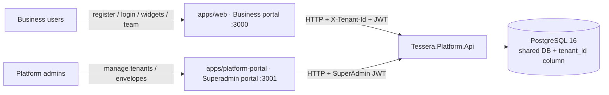
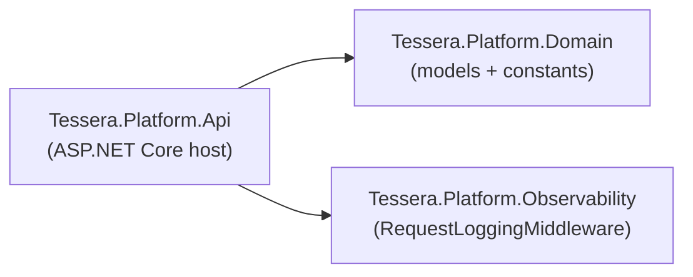
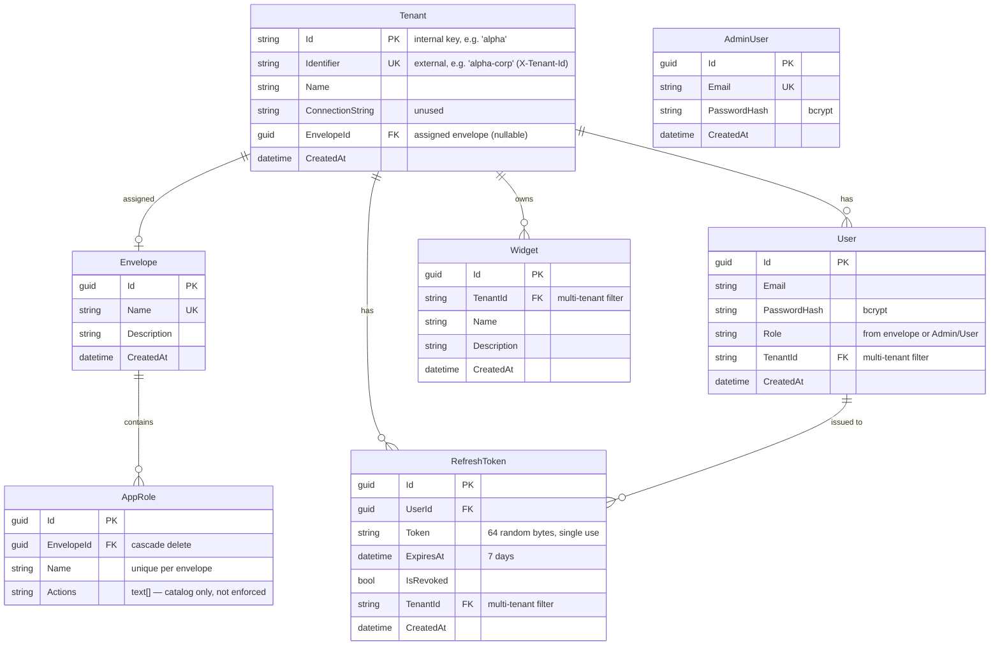
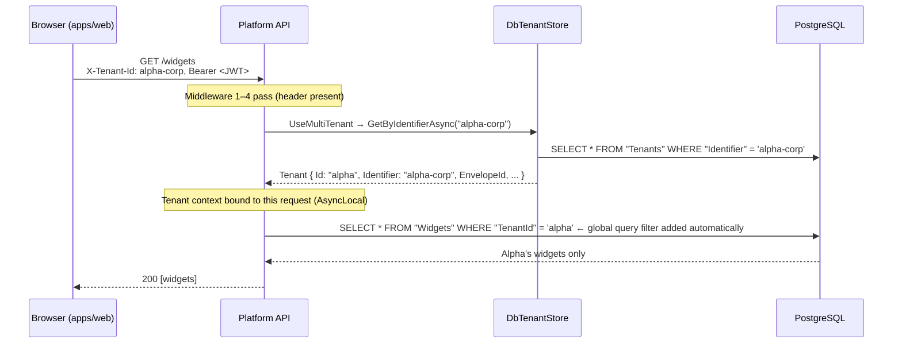
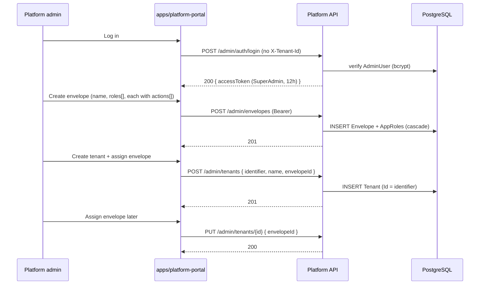
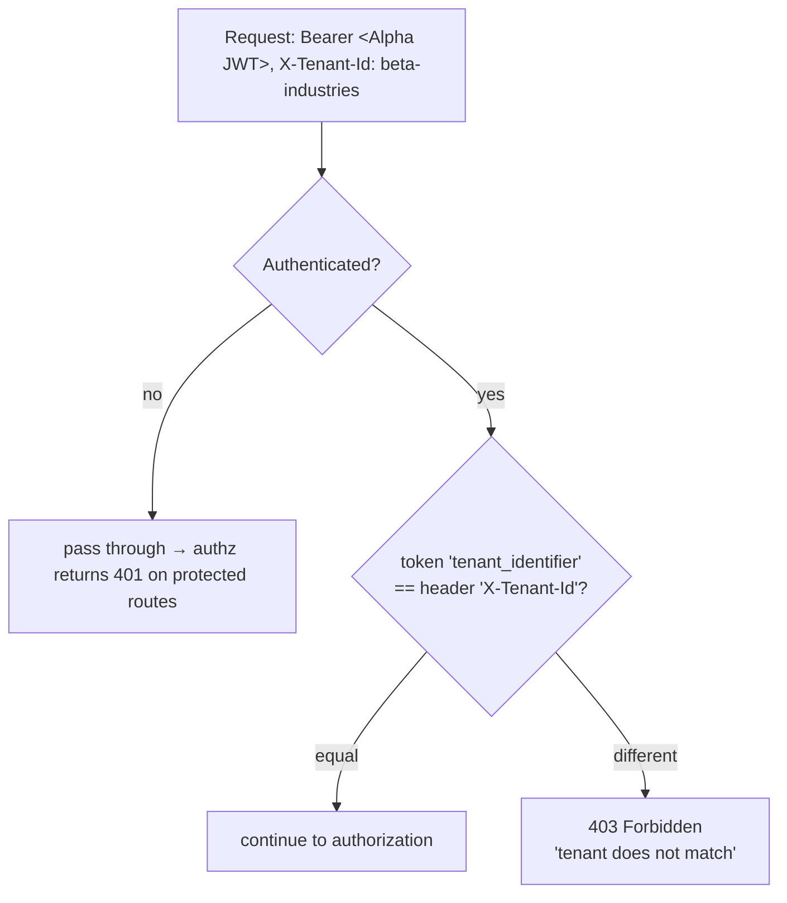
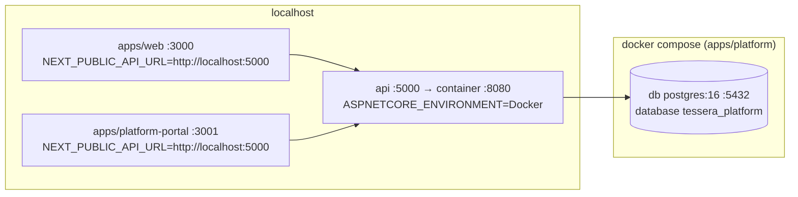

# Tessera — Architecture

> **Last verified against the code**: 2026-08-14
> **Read this first.** This document is the single source of truth for how the
> system fits together. If something here disagrees with what you see in the
> code, the code is newer — update this file.

---

## 1. Overview

Tessera is a **multi-tenant SaaS platform**: a C# "platform" service owns the
cross-cutting concerns (authentication, authorization, tenant context, roles &
actions) and exposes them through a JSON API consumed by **two Next.js
frontends**.



**Key rule**: the C# platform is the **source of truth** for auth, authz,
tenant context, roles, and (eventually) action enforcement. Frontends consume
its APIs; they never re-implement these concerns.

### The two portals

| Portal | App | Port | Audience | Auth | What it does |
|---|---|---|---|---|---|
| **Business portal** | `apps/web` | 3000 | Workspace users | Tenant JWT + `X-Tenant-Id` header | Register/login per workspace, widget CRUD, Team management (admins) |
| **Platform portal** | `apps/platform-portal` | 3001 | Platform admins (superadmins) | `SuperAdmin` JWT, **no** tenant header | Create/edit/delete tenants, create/edit/delete envelopes (roles + actions) |

---

## 2. Repository layout

```
Tessera/
├── Directory.Build.props            # Shared MSBuild props (net10.0, Nullable, ImplicitUsings)
├── .dockerignore                    # Excludes bin/obj, project-management/, etc. from Docker builds
├── .gitignore                       # dotnet gitignore (+ .env)
├── readme.md                        # Repo scaffolding checklist (roadmap for the repo itself)
├── docs/
│   └── ARCHITECTURE.md              # ← you are here
├── project-management/              # roadmap · tasks · decisions · learning-log · progress
├── infra/                           # placeholder (cloud provisioning — not yet used)
├── scripts/                         # placeholder (not yet used)
├── .claude/AGENTS.md                # Claude Code agent rules
└── apps/
    ├── web/                         # Next.js 16 business (tenant) portal — :3000
    ├── platform-portal/             # Next.js 16 superadmin portal — :3001
    └── platform/                    # C# platform service (this doc's focus)
        ├── Dockerfile               # Multi-stage .NET 10 build (SDK → publish → aspnet runtime)
        ├── docker-compose.yml       # api (:5000) + PostgreSQL 16 (:5432), pgdata volume
        ├── Tessera.Platform.slnx    # Solution (Api, Domain, Observability)
        ├── Guide.md                 # Operational guide: run + test instructions
        └── src/
            ├── Tessera.Platform.Api/           # ASP.NET Core host (endpoints, middleware, services, data)
            ├── Tessera.Platform.Domain/        # Plain class library: domain models + constants
            └── Tessera.Platform.Observability/ # Class library: shared middleware (RequestLogging)
```

---

## 3. Glossary — read this to avoid blunders

These are the concepts that have caused confusion before. Get them right.

| Term | Meaning |
|---|---|
| **Tenant** | A workspace/company that uses the platform. A row in the `Tenants` table. |
| **`Tenant.Id`** | **Internal** database key, e.g. `"alpha"`. Stored on every tenant-scoped row (`Users.TenantId`, `Widgets.TenantId`, ...). Chosen by Finbuckle seed for built-ins; for superadmin-created tenants, `Id == Identifier`. |
| **`Tenant.Identifier`** | **External** lookup key, e.g. `"alpha-corp"`. This is what clients send in the `X-Tenant-Id` header. **`Id` and `Identifier` are different values for the seeded tenants.** |
| **`X-Tenant-Id` header** | Required on every tenant-scoped request (except `/health`, `/openapi`, `/admin`, `/tenants`). Contains the **identifier**, e.g. `alpha-corp`. |
| **Widget** | **Placeholder demo resource** — a "todo" equivalent used to prove tenant isolation, auth, and RBAC work end-to-end. **Not a product feature.** Its entire tenant-isolation mechanism is Finbuckle (see §5). |
| **Envelope** | A bundle of **roles + their actions**, created by a superadmin and assigned to a tenant. Defines which roles a tenant can assign to its users. |
| **AppRole** | A role **inside an envelope** (`Envelopes 1—n AppRoles`). Has a `Name` and an `Actions` list (`text[]`). |
| **Action** | A named Tessera capability (e.g. `create_widget`, `edit_widget`, `manage_users`). **Catalog-only today — NOT enforced** (see §13 backlog). |
| **User** | A tenant-scoped user (`Users` table): bcrypt-hashed password, single `Role` string, `TenantId`. Auth via `/auth/*`. |
| **AdminUser** | A **platform-level superadmin** (`AdminUsers` table): no tenant binding, bcrypt hash. Auth via `/admin/auth/login`. `admin@…` (tenant) vs `superadmin@…` (platform) are **different tables and accounts**. |
| **Roles constants** | Built-ins in `User.cs`: `Admin`, `User`, `SuperAdmin`. Used by authorization policies (`AdminOnly`, `SuperAdminOnly`). |
| **Envelope roles** | Roles defined per-envelope (e.g. `Manager`, `Editor`). Assigned to users by a tenant admin; validated against the tenant's envelope. A user's `Role` string must come from the envelope (or the built-ins when no envelope is assigned). |
| **Bootstrap rule** | The **first user to register in a workspace becomes its `Admin`** (`AuthService.RegisterAsync`). Needed because `EnforceMultiTenant` (Finbuckle) makes seeding tenant users at startup impossible without raw SQL. |
| **Tenant admin** | A `User` whose `Role == "Admin"`. Can manage the team (`/tenant/users`) and delete widgets. |
| **Superadmin** | An `AdminUser`. Can manage tenants + envelopes via `/admin/*`. |

---

## 4. Tech stack

| Layer | Tech | Version |
|---|---|---|
| Backend runtime | .NET (ASP.NET Core, minimal APIs) | `net10.0` / SDK 10.0.302 |
| ORM | EF Core (`Microsoft.EntityFrameworkCore`) + Npgsql | 10.0.10 / 10.0.0 |
| Multi-tenancy | **Finbuckle.MultiTenant** (+ AspNetCore + EntityFrameworkCore + Abstractions) | 10.1.2 |
| Auth | JWT (`Microsoft.AspNetCore.Authentication.JwtBearer`), BCrypt (`BCrypt.Net-Next`) | 10.0.10 / 4.0.3 |
| Logging | Serilog (console sink) | 10.0.0 |
| Database (prod/dev) | PostgreSQL | 16 (`postgres:16-alpine`) |
| Database (fallback dev) | EF Core InMemory provider | 10.0.10 |
| Frontends | Next.js (App Router, Turbopack) · React · TypeScript strict · Tailwind CSS v4 | 16.3.0 / 19.2.8 / 5 / 4 |

---

## 5. The platform service (`apps/platform`)

### 5.1 Project structure



- **`Tessera.Platform.Domain`** — plain class library, zero ASP.NET dependencies. Holds every model and the `Roles` / `ActionCatalog` constants. The API host references it.
- **`Tessera.Platform.Observability`** — class library using a `FrameworkReference` to `Microsoft.AspNetCore.App` (so it can use `HttpContext` without the Web SDK). Currently contains only `RequestLoggingMiddleware`.
- **`Tessera.Platform.Api`** — the host: `Program.cs` wiring, `Endpoints/`, `Middleware/`, `Services/`, `Data/`, `Migrations/`, config files.

### 5.2 Data model (PostgreSQL schema)

Eight tables. Tenant-scoped tables (`Users`, `Widgets`, `RefreshTokens`) carry a
`TenantId` and are marked `IsMultiTenant()` → Finbuckle adds a global query
filter. Platform-level tables (`Tenants`, `Envelopes`, `AppRoles`, `AdminUsers`)
are **not** multi-tenant.



**Deletion rules** (admin endpoints):
- **Delete tenant** → cascades: removes the tenant's `Users` and `RefreshTokens`, then the `Tenant` row. PostgreSQL uses raw SQL (bypasses `EnforceMultiTenant`); InMemory uses `MultiTenantDbContext.Create<TContext,TTenantInfo>` bound to the deleted tenant.
- **Delete envelope** → first **unassigns** it from all tenants (`Tenant.EnvelopeId = null`), then deletes the envelope and its roles (cascade).

Migrations: `InitialCreate` (Widgets) → `AddAuthTables` (Users, RefreshTokens) → `AddUserRole` (Role column) → `AddPlatformAdmin` (Tenants, Envelopes, AppRoles, AdminUsers + `Tenant.EnvelopeId`). Applied on startup with `IsRelational()` guard.

### 5.3 Middleware pipeline (exact order)

Registered in `Program.cs` in this order — order is load-bearing:

```mermaid
flowchart LR
    REQ[HTTP request] --> HTTPS[HttpsRedirection]
    HTTPS --> EX[1. ExceptionHandlingMiddleware]
    EX --> RL[2. RequestLoggingMiddleware]
    RL --> CORS[3. CORS 'WebApp']
    CORS --> TV[4. TenantValidationMiddleware]
    TV --> MT[5. UseMultiTenant]
    MT --> AU[6. UseAuthentication]
    AU --> TC[7. TenantClaimValidationMiddleware]
    TC --> AZ[8. UseAuthorization]
    AZ --> EP[Endpoint]
```



| # | Middleware | What it does | Fails with |
|---|---|---|---|
| 0 | `UseHttpsRedirection` | Redirects HTTP → HTTPS when configured (dev: no-op over plain http). | — |
| 1 | `ExceptionHandlingMiddleware` | Wraps everything after it in try/catch; maps exceptions → HTTP status + `ApiErrorResponse` JSON (see §11). | 400/404/403/499/500/502/501 |
| 2 | `RequestLoggingMiddleware` (Observability) | Logs method, path, status, duration for every request. | — |
| 3 | CORS `WebApp` | Allows origins `http(s)://localhost:3000` and `:3001`, any header/method. Runs **before** tenant validation so browser preflights (OPTIONS, no custom headers) aren't rejected. | — |
| 4 | `TenantValidationMiddleware` | Requires `X-Tenant-Id` header on all paths **except** `/health`, `/openapi`, `/admin`, `/tenants`. | **400** (missing header) |
| 5 | `UseMultiTenant()` | Finbuckle: resolves the tenant from the header via the **`DbTenantStore`** and sets the per-request tenant context. | 500 if store fails |
| 6 | `UseAuthentication()` | Validates the Bearer JWT (issuer, audience, lifetime, HMAC-SHA256 signature, zero clock skew). | **401** (missing/invalid token) |
| 7 | `TenantClaimValidationMiddleware` | For authenticated requests: compares the JWT's **`tenant_identifier`** claim to the `X-Tenant-Id` header. Blocks cross-tenant token reuse. Superadmin JWTs have no tenant claim → skipped. | **403** (mismatch) |
| 8 | `UseAuthorization()` | Enforces policies: `AdminOnly` (role `Admin`), `SuperAdminOnly` (role `SuperAdmin`). | **403** (insufficient role) |

### 5.4 Tenant resolution — how a request gets its tenant



**Why the database-backed store?** The first Finbuckle setup used
`WithInMemoryStore` with hardcoded tenants — superadmins couldn't add tenants at
runtime. `DbTenantStore` (`Data/DbTenantStore.cs`) implements
`IMultiTenantStore<Tenant>` against the `Tenants` table
(`GetAsync`/`GetByIdentifierAsync`/`GetByIdAsync`/`GetAllAsync`/`AddAsync`/`UpdateAsync`/`RemoveAsync`)
using scoped `AppDbContext` instances. Registered via
`.WithStore<DbTenantStore>(ServiceLifetime.Singleton)`.

**Why `MultiTenantDbContext`?** `AppDbContext` inherits Finbuckle's
`MultiTenantDbContext`:
- entities configured with `entity.IsMultiTenant()` get a `TenantId` column + a **global query filter** scoped to the request's tenant (SQL: `WHERE "TenantId" = @current`);
- on `SaveChanges`, Finbuckle's **`EnforceMultiTenant`** auto-sets `TenantId` on inserts and throws on mismatches. ⚠️ It requires a tenant context — see §14 gotchas.

---

## 6. Authentication & authorization

### 6.1 Two token kinds

| | Tenant user JWT | Superadmin JWT |
|---|---|---|
| Issued by | `POST /auth/register`, `/auth/login`, `/auth/refresh` | `POST /admin/auth/login` |
| Claims | `sub`, `email`, `ClaimTypes.Role` (e.g. `Admin`), `tenant_id` (internal, e.g. `"alpha"`), `tenant_identifier` (external, e.g. `"alpha-corp"`), `jti`, `iat` | `sub`, `email`, `role = SuperAdmin`, `jti`, `iat` — **no tenant claims** |
| Lifetime | 15 minutes (`Jwt:AccessTokenExpirationMinutes`) | 12 hours (`Jwt:AdminAccessTokenExpirationHours`) |
| Refresh | Yes — 64 random bytes, 7 days, stored in `RefreshTokens`, single-use (revoked on refresh) | **No** — portal re-logins on expiry |
| Signing | HMAC-SHA256, symmetric dev key `Jwt:SecretKey` | same |
| Enforced by | `AdminOnly` policy + `TenantClaimValidationMiddleware` | `SuperAdminOnly` policy |

The client keeps tokens in `localStorage` (`tessera.auth` for business portal,
`tessera.admin` for platform portal) — **not** httpOnly cookies.

### 6.2 Tenant user flow: register → login → refresh

```mermaid
sequenceDiagram
    participant U as Tenant user
    participant W as apps/web (business portal)
    participant P as Platform API
    participant DB as PostgreSQL

    U->>W: Register (email, password, workspace)
    W->>P: POST /auth/register + X-Tenant-Id
    P->>DB: email already in this tenant? (query filter scopes it)
    P->>DB: INSERT User (bcrypt; role = Admin if this is the tenant's first user)
    P->>DB: INSERT RefreshToken (64 random bytes, 7d)
    P-->>W: 201 { accessToken (15m), refreshToken }
    W->>W: save tokens + tenantId to localStorage, redirect /dashboard

    U->>W: Log in
    W->>P: POST /auth/login + X-Tenant-Id
    P->>DB: find user by email (tenant-scoped), bcrypt verify
    P-->>W: 200 { accessToken, refreshToken }

    Note over W,P: Any API call returning 401 → POST /auth/refresh (revokes old token)<br/>→ new pair → retry original call once. (lib/api.ts)
```

### 6.3 Superadmin flow: envelopes → tenants



### 6.4 Cross-tenant token attack (blocked)

A valid JWT for tenant A is useless against tenant B: `TenantClaimValidationMiddleware`
compares the JWT's **`tenant_identifier`** claim (external name, e.g.
`alpha-corp`) with the header. ⚠️ It deliberately does **not** compare the
`tenant_id` claim (internal id, e.g. `alpha`) — that was a real bug fixed in
Session 8; the two never matched.



---

## 7. API surface (complete)

All tenant-scoped endpoints require `X-Tenant-Id`. All responses use JSON.
Errors use `ApiErrorResponse` (see §11).

| Method | Path | Tenant header | Auth | Purpose |
|---|---|---|---|---|
| GET | `/health` | no | public | Liveness: `{ status: "healthy", timestamp }` (used by the HealthBadge) |
| GET | `/tenants` | no | public | `[{ id: identifier, name }]` for the workspace picker |
| GET | `/openapi` | no | public | OpenAPI JSON (dev only) |
| POST | `/auth/register` | **yes** | public | Create tenant user → token pair (first user becomes Admin) |
| POST | `/auth/login` | **yes** | public | Verify credentials → token pair |
| POST | `/auth/refresh` | **yes** | public | Exchange refresh token → new pair (old revoked) |
| POST | `/auth/promote` | yes | `AdminOnly` | Set a user's role to `Admin` |
| GET | `/widgets` | yes | tenant user | List tenant's widgets (filtered) |
| GET | `/widgets/{id:guid}` | yes | tenant user | Get one widget |
| POST | `/widgets` | yes | tenant user | Create widget |
| PUT | `/widgets/{id:guid}` | yes | tenant user | Update widget |
| DELETE | `/widgets/{id:guid}` | yes | `AdminOnly` | Delete widget |
| GET | `/tenant/me` | yes | tenant user | `{ id, email, role, actions[], tenantId, tenantIdentifier }` — actions from the user's envelope role |
| GET | `/tenant/envelope` | yes | tenant user | The workspace's envelope (roles + actions) |
| GET | `/tenant/users` | yes | `AdminOnly` | List workspace users (no password hash) |
| POST | `/tenant/users` | yes | `AdminOnly` | Add user `{ email, password, role }` — role must be in the tenant's envelope |
| PUT | `/tenant/users/{id:guid}` | yes | `AdminOnly` | Change a user's role (cannot change your own; role validated against envelope) |
| DELETE | `/tenant/users/{id:guid}` | yes | `AdminOnly` | Remove a user (cannot remove yourself) |
| POST | `/admin/auth/login` | no | public | Superadmin login → `SuperAdmin` JWT |
| GET/POST | `/admin/tenants` | no | `SuperAdminOnly` | List / create tenants |
| PUT/DELETE | `/admin/tenants/{id}` | no | `SuperAdminOnly` | Update / delete tenant (delete cascades users + tokens) |
| GET/POST | `/admin/envelopes` | no | `SuperAdminOnly` | List / create envelopes (roles + actions) |
| PUT/DELETE | `/admin/envelopes/{id:guid}` | no | `SuperAdminOnly` | Update / delete envelope (delete unassigns tenants first) |

**Guards worth knowing** (return 400 `{ error }`):
- Tenant identifier must match `^[a-z0-9-]+$` and be unique.
- Envelope must have ≥ 1 role; role names unique within the envelope.
- `POST /tenant/users` validates email format, password ≥ 8 chars, role ∈ envelope.

---

## 8. Business portal (`apps/web`) — :3000

Next.js 16 App Router, TypeScript strict, Tailwind v4, coffee theme
(`globals.css` defines the `cream/beige/latte/caramel/mocha/roast/espresso`
palette).

| Route | File | Purpose |
|---|---|---|
| `/` | `app/page.tsx` | Landing page with `HealthBadge` (polls `GET /health`) + login/register CTAs |
| `/login` | `app/login/page.tsx` | Workspace login (tenant picker + credentials) |
| `/register` | `app/register/page.tsx` | Workspace signup (tenant picker + password confirmation) |
| `/dashboard` | `app/dashboard/page.tsx` | Widget CRUD + role badge + "your role allows" action pills (`GET /tenant/me`) |
| `/dashboard/users` | `app/dashboard/users/page.tsx` | **Team** (Admin-only UI): list users, add user (role from envelope), change role, remove |

Shared pieces:
- `lib/api.ts` — single API client. Sends `X-Tenant-Id` on every call, reads tokens from `localStorage["tessera.auth"]`, decodes the JWT role (`roleFromToken`), and **auto-refreshes on 401** (retry once via `POST /auth/refresh`). `getTenants()` populates the workspace picker dynamically with a built-in fallback (`TENANTS`).
- `components/ui.tsx` — `Button`, `Card`, `Field`, `TextInput`, `TextArea`, `Alert`.
- `components/portal-header.tsx` — brand + nav (Widgets / Team) + user info + logout.
- `components/tenant-picker.tsx` — workspace `<select>` fed by `GET /tenants`.
- `components/health-badge.tsx` — "API online/offline" indicator.

---

## 9. Platform portal (`apps/platform-portal`) — :3001

Same stack/theme as the business portal, but for superadmins.

| Route | File | Purpose |
|---|---|---|
| `/` | `app/page.tsx` | Redirects to `/tenants` (logged in) or `/login` |
| `/login` | `app/login/page.tsx` | Superadmin login |
| `/tenants` | `app/tenants/page.tsx` | List/create/edit/delete tenants, assign envelope |
| `/envelopes` | `app/envelopes/page.tsx` | List/create/edit/delete envelopes; role + comma-separated actions editor |

`lib/api.ts` differs from the business portal: **no `X-Tenant-Id` header**,
tokens in `localStorage["tessera.admin"]`, and **no auto-refresh** (12 h token;
on 401 the pages redirect to `/login`).

---

## 10. Running it

### 10.1 Docker Compose (the canonical way — PostgreSQL)



```bash
cd apps/platform
docker compose up -d --build    # builds .NET image, starts api + db (pgdata volume persists)
```

Then, in two terminals:
```bash
cd apps/web && npm run dev            # business portal → http://localhost:3000
cd apps/platform-portal && npm run dev  # platform portal → http://localhost:3001
```

The `.env.local` files in both apps currently set `NEXT_PUBLIC_API_URL=http://localhost:5000`
(the Docker API). Without them, both apps default to `http://localhost:5085`.

### 10.2 Local without Docker (InMemory fallback)

```bash
cd apps/platform
dotnet run --project src/Tessera.Platform.Api   # http://localhost:5085
```

With no connection string configured (`appsettings.json` has `""`), the API
uses the **EF Core InMemory provider** — data is ephemeral (resets on restart)
and behavior differs slightly (see gotchas).

### 10.3 Seeded data

| Seed | On InMemory | On PostgreSQL | Source |
|---|---|---|---|
| `Standard` envelope (roles `Admin`/`Manager`/`User` + actions) | ✅ | ✅ | `SeedPlatformDataAsync` (`Program.cs`) |
| Tenants `alpha-corp` (Id `alpha`), `beta-industries` (Id `beta`) | ✅ | ✅ | `SeedPlatformDataAsync` |
| Standard envelope assigned to tenants without one | ✅ | ✅ | `SeedPlatformDataAsync` |
| Superadmin `superadmin@tessera.com` / `Admin123!` (`AdminUsers`) | ✅ | ✅ | `SeedPlatformDataAsync` |
| Tenant admin `admin@tessera.com` / `Admin123!` per tenant (`Users`) | ❌ | ✅ | Raw SQL in `Program.cs` (Postgres only — see gotcha #4) |

Config lives in `appsettings.json`: `SeedAdmin`, `SeedSuperAdmin`, `Jwt`
(SecretKey/Issuer/Audience/expiries). The Docker environment overrides the
connection string via `appsettings.Docker.json` and `ConnectionStrings__DefaultConnection`.

---

## 11. Error contract

Every error response has this shape (from `ApiErrorResponse`):

```json
{
  "statusCode": 404,
  "message": "The requested resource was not found.",
  "details": null,
  "traceId": "0HM8K3T6G1V7A",
  "timestamp": "2026-07-27T12:00:00Z"
}
```

- `details` populated with the stack trace **only in Development**.
- `traceId` = `Activity.Current?.Id ?? context.TraceIdentifier` — correlates error ↔ log line.
- Exception → status mapping (`ExceptionHandlingMiddleware.MapException`):

| Exception | HTTP |
|---|---|
| `OperationCanceledException` / `TaskCanceledException` | 499 (client disconnected) |
| `KeyNotFoundException` / `FileNotFoundException` | 404 |
| `ArgumentException` / `InvalidOperationException` | 400 (message echoed) |
| `UnauthorizedAccessException` | 403 |
| `NotImplementedException` | 501 |
| `HttpRequestException` | 502 |
| anything else | 500 |

---

## 12. Security model — the four isolation layers

| Layer | Mechanism | Enforced where |
|---|---|---|
| 🆔 **Tenant resolution** | `X-Tenant-Id` header → `DbTenantStore` → Finbuckle context | `UseMultiTenant()` |
| 🗄️ **Data isolation** | `IsMultiTenant()` on `User`/`Widget`/`RefreshToken` → global query filters (`WHERE TenantId = …`) | DB queries; also `EnforceMultiTenant` on save |
| 🔐 **Token isolation** | JWT `tenant_identifier` claim must equal header | `TenantClaimValidationMiddleware` |
| 👑 **Permission isolation** | `Role` claim → `AdminOnly` / `SuperAdminOnly` policies | `UseAuthorization()` |

Endpoints always use `FirstOrDefaultAsync`/`ToListAsync` (never `FindAsync`,
which bypasses query filters). The tenant admin seed uses `IgnoreQueryFilters()`
deliberately at startup.

---

## 13. Known issues & backlog

| Item | Status |
|---|---|
| **Actions not enforced** | `ActionCatalog` entries on roles are **display-only**. Enforcement is on the backlog (Session 10 decision). |
| `NU1903` — `Microsoft.OpenApi` 2.0.0 vuln | Low severity, transitive; resolves with SDK/package update. |
| Tests | No automated test project yet (only manual curl smoke tests documented in `Guide.md` / `progress.md`). |
| Tenant picker | Populated from public `GET /tenants` — reveals tenant names to anyone (acceptable at this stage). |
| Observability | Correlation IDs across all components, metrics, structured logging conventions — Phase 4, not started. |
| Refresh tokens | Single-use rotation; no revocation endpoint; no logout server-side. Superadmins have no refresh at all (12 h token). |

---

## 14. Gotchas — the blunder list

Read these before changing anything. Each one caused a real bug or confusion.

1. **`tenant_id` ≠ `tenant_identifier`.** Internal id (`alpha`) vs external identifier (`alpha-corp`). `TenantClaimValidationMiddleware` compares the **identifier** claim against the header. Users store the **id** in `User.TenantId`.
2. **Widgets are demo data**, not a product feature. They exist to prove Finbuckle's tenant isolation. Don't model product requirements on them.
3. **`FindAsync` bypasses query filters** — always use `FirstOrDefaultAsync` on tenant-scoped queries.
4. **`EnforceMultiTenant` needs a tenant context.** Saving `IsMultiTenant` entities (User/Widget/RefreshToken) with no tenant context throws — that's why the tenant-admin seed uses raw SQL (Postgres) and why there's no seeded tenant admin on InMemory.
5. **InMemory provider limitations**: no raw SQL (`ExecuteSqlRawAsync`), no `ExecuteDelete/ExecuteUpdate`. Tenant deletion therefore branches: raw SQL on Postgres, `MultiTenantDbContext.Create` bound-context on InMemory.
6. **`admin@tessera.com` ≠ `superadmin@tessera.com`.** Different tables (`Users` vs `AdminUsers`). The tenant admin only exists on Postgres.
7. **Ports**: `5000` = Docker API · `5085` = local `dotnet run` · `3000` = business portal · `3001` = platform portal. Both `.env.local` files currently point to `:5000`.
8. **Middleware order is load-bearing** (see §5.3): exception → logging → CORS → tenant validation → multi-tenant → authN → tenant-claim check → authZ. CORS must run before tenant validation so preflights pass.
9. **CORS allowlist** is exactly `localhost:3000` and `localhost:3001` — a new frontend port requires updating `Program.cs`.
10. **Actions are a catalog, not enforcement.** A role's actions are display-only — no endpoint checks them yet.
11. **The `Tenant` entity doubles as the Finbuckle `ITenantInfo`** and a DB row. Its `ConnectionString` property is currently unused (single shared DB).
12. **`.env.local` files are gitignored** — if you move machines, recreate them (see `README.md` / `Guide.md`).

---

## 15. Recorded decisions (see `project-management/decisions.md` for detail)

- **Multitenancy**: shared DB + `tenant_id` column via Finbuckle.MultiTenant.
- **Auth**: roll-our-own JWT (bcrypt + access/refresh tokens) — swap to WorkOS/Auth0 possible later.
- **Cloud target**: Fly.io (not yet deployed; `fly.toml` doesn't exist).
- **Solution structure**: one service, three class libraries by concern (Api / Domain / Observability).
- **Logging**: Serilog, console sink.
- **Exceptions**: global middleware (not `IExceptionHandler`).
- **Monorepo**: all apps + platform in one repo.
- **Tenant bootstrap**: first registered user of a workspace becomes its Admin.
- **Actions**: kept on the backlog (Session 10 decision).

---

## 16. Where to go next (see `project-management/roadmap.md`)

1. **Observability** (Phase 4) — correlation IDs across C#/TS, structured log conventions in `Tessera.Platform.Observability`.
2. **CI pipeline** (Phase 7) — GitHub Actions split by path (ci-web / ci-platform / ci-infra).
3. **Deploy** — Fly.io + PostgreSQL, secrets management, dev container, onboarding doc.
