# Tessera — End-to-End Flow (Mermaid)

> **What this is:** the complete flow of Tessera as it exists today — the
> platform (C#), the MCP gateway (Python), the web portals (Next.js), the OAuth
> authorization server, and the SMB backend the tools actually operate on.
>
> **How it's organised:** §1 is one system overview you can read in a minute;
> §2–§6 break the same system into its modules. Every diagram is generated
> directly from the code in this repo.
>
> **Last verified against the code:** 2026-09-12 (live-verified end-to-end:
> Claude web → tunnel → Caddy → gateway → C# AS → Acme Dental stub).
>
> **Related:** [`docs/README.md`](README.md) (architecture index),
> [`docs/platform/README.md`](platform/README.md) (C# service),
> [`docs/mcp/README.md`](mcp/README.md) (MCP product model + gateway),
> [`docs/web/README.md`](web/README.md) (portals),
> [`docs/LIVE_TESTING_GUIDE.md`](LIVE_TESTING_GUIDE.md) (how to run it live).

## Diagram index

| # | Module | Diagram | Answers |
|---|---|---|---|
| 1 | **Overview** | System map | Who talks to whom, over what |
| 2 | **Platform** | Composition, middleware pipeline, tenant resolution, first-party auth, manifest admin | What the C# service does |
| 3 | **OAuth AS** | Discovery, CIMD registration, PKCE authorize + token exchange | How an AI assistant gets a token |
| 4 | **Gateway** | Request lifecycle, `tools/list`, `tools/call` execution | How a tool actually runs |
| 5 | **Web** | Portal routes, OAuth login + consent pages | What the human sees |
| 6 | **End-to-end** | The proven Claude web journey | The whole thing, start to finish |
| 7 | **Topology** | Local/Docker deployment, ports, routing | Where everything runs |

---

## 1. System overview

Four moving parts: the **C# platform** (system of record + OAuth authorization
server), the **Python MCP gateway** (protocol adapter), the **Next.js portals**
(human UI incl. the OAuth login/consent pages), and the **SMB backend** (the
real service the tools operate on — a stub in the fixture).

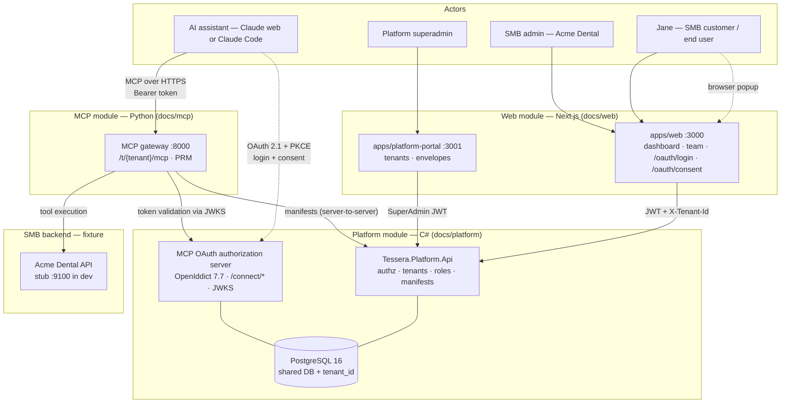

**The one rule that explains the whole design:** the C# platform is the
**system of record**. The gateway is a dumb protocol adapter — it never touches
the database and holds no business logic. Add a tool for a tenant by adding a
manifest row, never by deploying code.

---

## 2. Platform module (C#) — `apps/platform`

### 2.1 Composition

Three class libraries, one ASP.NET host. The host owns the composition root;
`Domain` has no ASP.NET dependency.

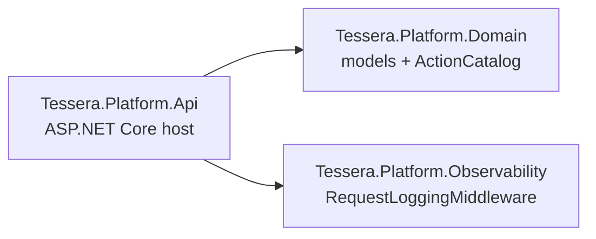

### 2.2 Middleware pipeline

Order is load-bearing. `/connect` and `/.well-known` are excluded from tenant
validation because on the MCP surface the tenant travels in the RFC 8707
`resource` parameter, not an `X-Tenant-Id` header.

```mermaid
flowchart LR
    Req["HTTP request"] --> Https["UseHttpsRedirection"]
    Https --> Ex["1 · ExceptionHandlingMiddleware"]
    Ex --> Log["2 · RequestLoggingMiddleware"]
    Log --> Cors["3 · CORS WebApp"]
    Cors --> Rate["4 · RateLimiter auth (429)"]
    Rate --> TV["5 · TenantValidationMiddleware (400)"]
    TV --> MT["6 · UseMultiTenant — Finbuckle"]
    MT --> Sus["7 · TenantSuspensionMiddleware (403)"]
    Sus --> AuthN["8 · UseAuthentication (401)"]
    AuthN --> TC["9 · TenantClaimValidationMiddleware (403)"]
    TC --> TVer["10 · TokenVersionValidationMiddleware (401)"]
    TVer --> AuthZ["11 · UseAuthorization (403)"]
    AuthZ --> Ep["Endpoint handler<br/>+ ActionChecks"]
```

### 2.3 Tenant resolution and data isolation

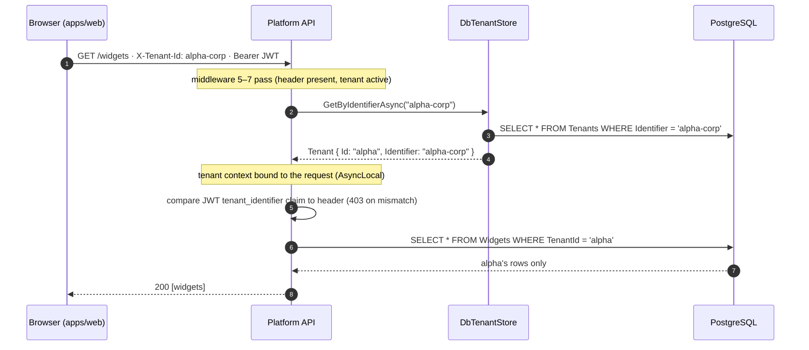

| Isolation layer | Mechanism |
|---|---|
| Tenant resolution | `X-Tenant-Id` → `DbTenantStore` → Finbuckle context |
| Data isolation | `IsMultiTenant()` → global query filters + `EnforceMultiTenant` on save |
| Token isolation | JWT `tenant_identifier` claim must equal the header |
| Permission isolation | Actions resolved live from `TenantRole` at request time |
| Session freshness | JWT `token_version` must equal the user's current version |

### 2.4 First-party auth (dashboards — unchanged by MCP)

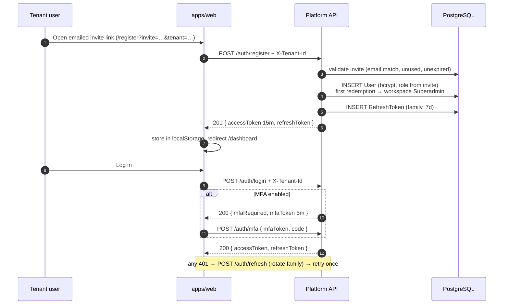

### 2.5 Manifest administration (the tool catalog's source of truth)

An SMB admin manages their tenant's tools through `manage_tools`-gated CRUD.
The `ToolManifests` table is the contract the gateway reads.

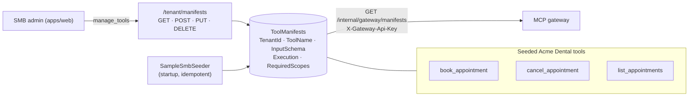

---

## 3. OAuth module — the authorization server (`/connect/*` + `/.well-known/*`)

The AI assistant is an OAuth **client**; the user is authenticated against the
SMB's identity; the token is bound to one tenant's MCP URL so it can never be
replayed against another tenant.

### 3.1 Discovery — how the assistant finds the AS

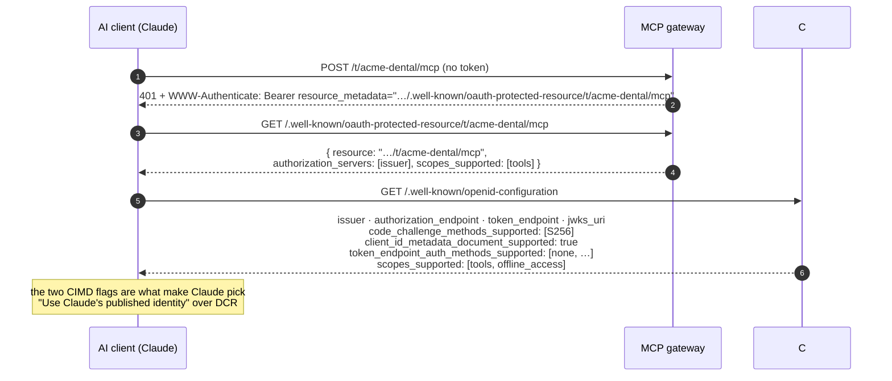

### 3.2 Client registration — CIMD

No dynamic registration endpoint is needed. The client's `client_id` **is** an
HTTPS URL pointing at a Client ID Metadata Document; the AS fetches and caches it.

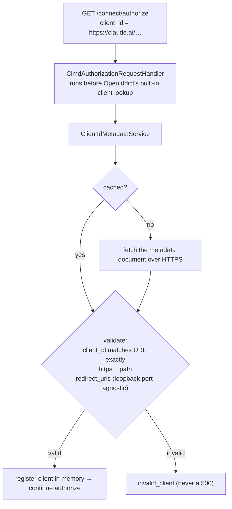

### 3.3 Authorization code + PKCE, login, and consent

The interactive pages are served by the Next.js portal on the **same origin** as
the AS, which is why `/oauth/*` calls are relative and the OAuth cookie works.

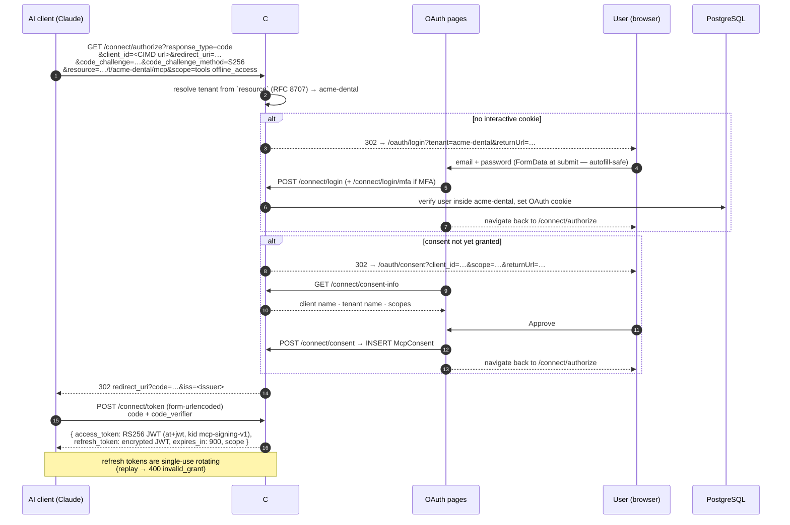

**Token shape** (the contract the gateway consumes):

| Claim | Value |
|---|---|
| `iss` | the public origin (`https://<origin>/`) |
| `aud` | `https://<origin>/t/{tenant}/mcp` — the RFC 8707 tenant binding |
| `scope` | `tools offline_access` (coarse, per tenant — v1) |
| `sub` | the tenant-scoped user id |
| header | `alg=RS256`, `typ=at+jwt`, `kid=mcp-signing-v1`, **no `enc`** (signed-only, gateway-friendly) |

The signing keys are published at `/.well-known/jwks`; refresh tokens stay
encrypted with a key the gateway never sees.

---

## 4. MCP gateway module (Python) — `apps/mcp-server`

### 4.1 Request lifecycle

One gateway, one low-level MCP `Server` per tenant, LRU-cached. Raw-ASGI
dispatch keeps the tenant app in the request path untouched.

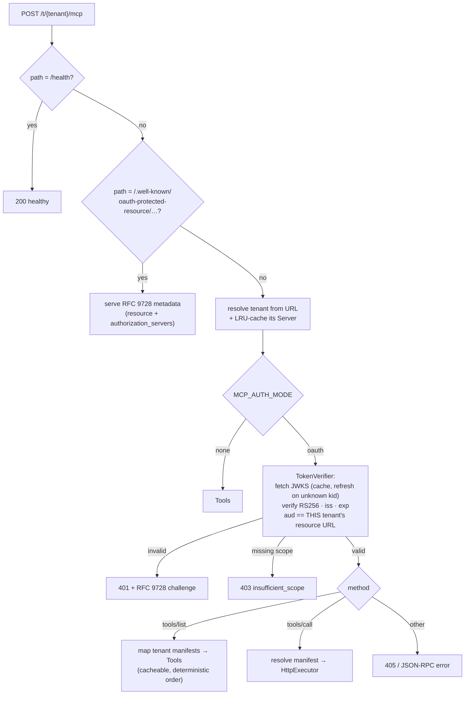

### 4.2 `tools/call` — how a tool actually executes

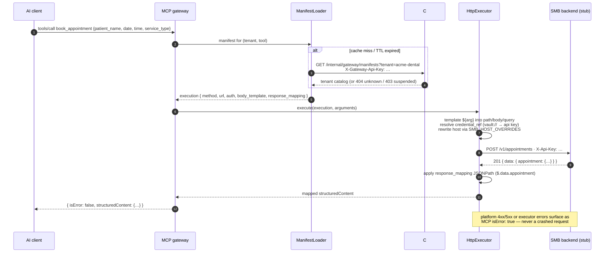

---

## 5. Web module (Next.js) — `apps/web` + `apps/platform-portal`

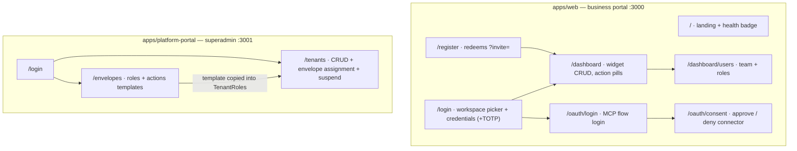

**Two conventions worth remembering:**

- Dashboard API calls carry `X-Tenant-Id` + a tenant JWT and use
  `NEXT_PUBLIC_API_URL` (absolutely addressed).
- `/oauth/*` calls are **relative** — those pages are served from the same
  origin as the AS by Caddy/tunnel, so the OAuth cookie and the authorize
  redirect stay on one origin.

---

## 6. End-to-end — the proven live journey

This is the flow that was verified working on 2026-09-12 against real
infrastructure (a cloudflared tunnel, the dockerized stack, and claude.ai).

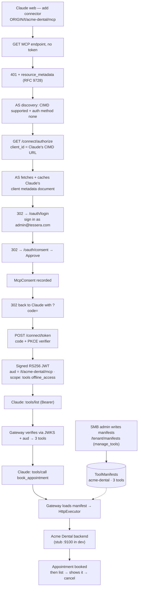

**Live evidence:** `tools/list` returned all three tools;
`tools/call book_appointment` booked an appointment with the credential
injected and the response mapped; a follow-up `list_appointments` showed it; a
direct gateway call with a real AS-issued RS256 token confirmed
`aud = <origin>/t/acme-dental/mcp`. See
[`docs/LIVE_TESTING_GUIDE.md`](LIVE_TESTING_GUIDE.md) §6 for the checklist.

---

## 7. Deployment topology (local / Docker)

Everything is served from **one origin** so the browser-facing OAuth flow and
the gateway share a hostname. The origin is either `https://tessera.local`
(local) or a public tunnel hostname (Claude web).

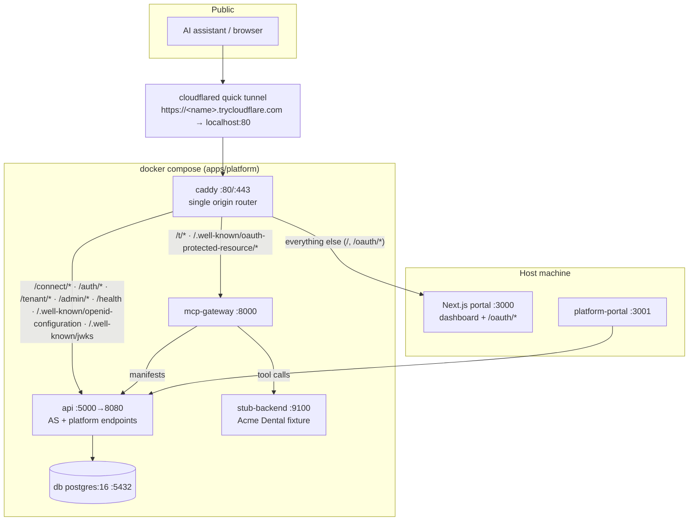

| Service | Local address | Notes |
|---|---|---|
| Business portal | `http://localhost:3000` | Runs on the host, not in compose (live rebuilds). |
| Platform portal | `http://localhost:3001` | Superadmin; no tenant header. |
| Platform API | `http://localhost:5000` (docker) / `:5085` (`dotnet run`) | Requires `--no-launch-profile` to honour `ASPNETCORE_URLS`. |
| MCP gateway | `http://localhost:8000` | `MCP_AUTH_MODE` defaults to `oauth`. |
| Acme Dental stub | `http://localhost:9100` | Fixture backend; in-memory, resets on restart. |
| PostgreSQL | `localhost:5432` | `tessera_platform`; `pgdata` volume. |

Driver script: `./scripts/start-claude-web.sh` starts the tunnel, writes
`ORIGIN`, brings the stack up, starts the portal, and verifies the whole OAuth
surface before printing the connector URL. `--stop` tears it all down.

---

## 8. What is deliberately not built yet

Kept here so the diagrams above are not mistaken for the finished product.

| Boundary | Current state |
|---|---|
| **End-user (Jane) identity** | The AS authenticates the **tenant admin** for their own tenant. Per-patient/per-user tool authorization is not modelled; `required_scopes` on manifests are not enforced (the coarse `tools` scope is). |
| **Per-tool scopes / step-up** | Coarse per-tenant `tools` + `offline_access` only. |
| **Credential vault** | Dev resolves `vault://` refs from an env map. Production needs the encrypted-at-rest store + KMS. |
| **Manifest versioning** | No defined behaviour yet for cached tools / issued tokens / consent when a manifest changes. |
| **Identity federation** | SMB-as-IdP (SAML/OAuth) is a later upgrade; today it's a Tessera-hosted mirror account. |
| **Production hosting** | Local TLS via Caddy + a tunnel; no deployed environment, CI, or observability sink. |
| **ChatGPT** | Requires a Business/Edu workspace for custom connectors; untested. |
