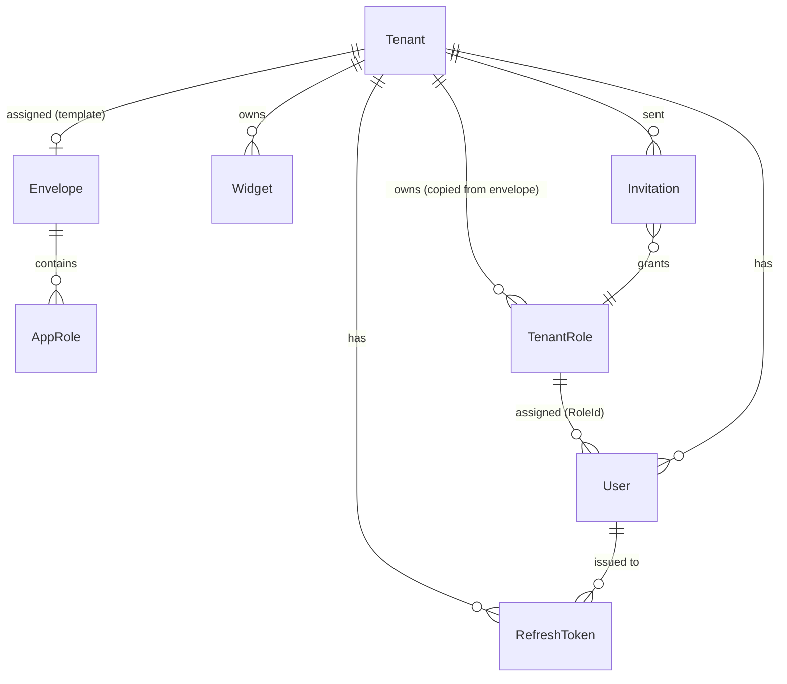

# Tessera — Database Tables

> 📐 **Architecture**: see **[`docs/ARCHITECTURE.md`](ARCHITECTURE.md)** — the single source of truth for how the system fits together. This file is a focused reference for the database schema (PostgreSQL, database `tessera_platform`).

The schema has **9 application tables** plus EF Core's `__EFMigrationsHistory` bookkeeping table. They split into two groups:

- **Platform-level** (not tenant-scoped, no `TenantId`): `Tenants`, `Envelopes`, `AppRoles`, `AdminUsers`
- **Tenant-scoped** (marked `IsMultiTenant()` → Finbuckle adds a `TenantId` column + global query filter): `Widgets`, `Users`, `RefreshTokens`, `TenantRoles`, `Invitations`

---

## Platform-level tables

### `Tenants`

A workspace/company using the platform. Doubles as the Finbuckle `ITenantInfo` (see ARCHITECTURE.md §3). Serves as the Finbuckle tenant store via `DbTenantStore`.

| Column | Type | Notes |
|---|---|---|
| `Id` | text | **PK** — internal key, e.g. `"alpha"` |
| `Identifier` | varchar(200) | **unique** — external lookup key sent in the `X-Tenant-Id` header, e.g. `"alpha-corp"` |
| `Name` | varchar(200) | display name |
| `ConnectionString` | text | nullable — currently unused (single shared DB) |
| `EnvelopeId` | uuid | nullable FK → `Envelopes.Id` — the **template** whose roles are copied into `TenantRoles` |
| `Status` | varchar(20) | `Active` or `Suspended` (B3) — suspended tenants are blocked by `TenantSuspensionMiddleware` |
| `IsDeleted` | boolean | soft delete (B4) — filtered from the store and public list |
| `xmin` | xid (system) | Postgres rowversion — optimistic concurrency (D2) |
| `CreatedAt` | timestamptz | |

**Indexes:** `IX_Tenants_Identifier` (unique on `Identifier`).

### `Envelopes`

A bundle of roles + their actions, created by a superadmin. **Template** semantics: when assigned to a tenant, its roles are *copied* into the tenant's own role set; later envelope edits don't propagate.

| Column | Type | Notes |
|---|---|---|
| `Id` | uuid | **PK** |
| `Name` | varchar(100) | **unique** |
| `Description` | varchar(500) | nullable |
| `CreatedAt` | timestamptz | |

**Indexes:** `IX_Envelopes_Name` (unique on `Name`).

### `AppRoles`

A role **inside an envelope** (the template). The `Actions` column lists the Tessera capabilities the role is allowed.

| Column | Type | Notes |
|---|---|---|
| `Id` | uuid | **PK** |
| `EnvelopeId` | uuid | **FK** → `Envelopes.Id`, cascade delete |
| `Name` | varchar(100) | unique per envelope (`EnvelopeId` + `Name`) |
| `Actions` | text[] | action catalog: `view_widgets`, `create_widget`, `edit_widget`, `delete_widget`, `manage_users` |

**Indexes / constraints:** `IX_AppRoles_EnvelopeId_Name` (unique on `{EnvelopeId, Name}`) · `FK_AppRoles_Envelopes_EnvelopeId` (cascade delete).

### `AdminUsers`

Platform-level superadmin accounts (no tenant binding). Authenticate via `/admin/auth/login` — different table from tenant `Users` (see ARCHITECTURE.md §6).

| Column | Type | Notes |
|---|---|---|
| `Id` | uuid | **PK** |
| `Email` | varchar(256) | **unique** |
| `PasswordHash` | text | bcrypt |
| `CreatedAt` | timestamptz | |

**Indexes:** `IX_AdminUsers_Email` (unique on `Email`).

---

## Tenant-scoped tables

### `Widgets`

The **placeholder demo resource** — a "todo" equivalent used to prove tenant isolation, auth, and RBAC work end-to-end. Not a product feature (see ARCHITECTURE.md §3).

| Column | Type | Notes |
|---|---|---|
| `Id` | uuid | **PK** |
| `TenantId` | text | set by Finbuckle — global query filter |
| `Name` | varchar(200) | |
| `Description` | varchar(1000) | nullable |
| `CreatedAt` | timestamptz | |

### `Users`

Tenant-scoped users. Permissions come from the assigned tenant role via `RoleId` (action-based authz — renames never break it). Onboarding is invite-only: the first invite redeemed in a workspace becomes its platform-managed **Superadmin**; Admins and members join via invitations.

| Column | Type | Notes |
|---|---|---|
| `Id` | uuid | **PK** |
| `Email` | varchar(256) | part of the filtered unique index `(Email, TenantId) WHERE NOT IsDeleted` |
| `PasswordHash` | text | bcrypt |
| `RoleId` | uuid | nullable FK → `TenantRoles.Id` (replaces the old `Role` string) |
| `TenantId` | text | set by Finbuckle — global query filter |
| `TokenVersion` | integer | bumped on role/password/MFA change; validated as the JWT `token_version` claim per request (A5) |
| `IsDeleted` | boolean | soft delete (B4) |
| `EmailVerified` | boolean | email verification (C2) |
| `VerificationToken` | text | SHA-256 hash of the emailed verification token |
| `VerificationTokenExpiresAt` | timestamptz | 24 h |
| `PasswordResetToken` | text | SHA-256 hash of the emailed reset token |
| `PasswordResetTokenExpiresAt` | timestamptz | 1 h |
| `MfaSecret` | text | nullable — base32 TOTP secret |
| `MfaEnabled` | boolean | |
| `xmin` | xid (system) | Postgres rowversion — optimistic concurrency (D2) |
| `CreatedAt` | timestamptz | |

**Indexes:** `IX_Users_RoleId` · `IX_Users_Email_TenantId` (**unique, filtered** `WHERE NOT "IsDeleted"`).

### `RefreshTokens`

Rotating refresh tokens with **family-based reuse detection** (C1): replaying a revoked token revokes the whole family. Server-side logout and password/MFA/role changes revoke tokens too.

| Column | Type | Notes |
|---|---|---|
| `Id` | uuid | **PK** |
| `UserId` | uuid | indexed — FK to `Users.Id` (by convention, no FK constraint) |
| `Token` | varchar(512) | 64 random bytes, base64 |
| `FamilyId` | uuid | token family — all tokens minted by the same login share it |
| `ExpiresAt` | timestamptz | 7 days |
| `IsRevoked` | boolean | |
| `CreatedAt` | timestamptz | |
| `TenantId` | text | set by Finbuckle — global query filter |

**Indexes:** `IX_RefreshTokens_UserId` · `IX_RefreshTokens_FamilyId`.

### `TenantRoles`

The tenant's **own** role set — copied from the assigned envelope template at assignment (or the built-in `Admin`/`User` roles when no envelope is assigned). Tenants CRUD these roles and assign them to users; superadmin envelope edits don't cascade.

| Column | Type | Notes |
|---|---|---|
| `Id` | uuid | **PK** |
| `TenantId` | text | set by Finbuckle — global query filter |
| `EnvelopeRoleId` | uuid | nullable — the `AppRoles.Id` this was copied from (informational) |
| `Name` | varchar(100) | unique per tenant (`TenantId` + `Name`) |
| `Actions` | text[] | action catalog — enforced server-side (`ActionChecks`) |
| `IsSystem` | boolean | platform-managed role: the tenant's **Superadmin** tier — all actions, not renameable/editable/deletable, not tenant-assignable |
| `xmin` | xid (system) | Postgres rowversion — optimistic concurrency (D2) |
| `CreatedAt` | timestamptz | |

**Indexes / constraints:** `IX_TenantRoles_TenantId_Name` (unique on `{TenantId, Name}`).

### `Invitations`

Role-bound invitations for onboarding (B2). Redeemed once via `/auth/register` with the invite token.

| Column | Type | Notes |
|---|---|---|
| `Id` | uuid | **PK** |
| `TenantId` | text | set by Finbuckle — global query filter |
| `Email` | varchar(256) | invitee — the token only redeems for this email |
| `RoleId` | uuid | FK → `TenantRoles.Id` — the role granted on redemption |
| `TokenHash` | varchar(64) | SHA-256 hash of the raw invite token (raw token is only emailed) |
| `ExpiresAt` | timestamptz | 72 h |
| `UsedAt` | timestamptz | nullable — single-use |
| `CreatedAt` | timestamptz | |

**Indexes:** `IX_Invitations_Email` · `IX_Invitations_TokenHash`.

---

## EF Core bookkeeping

### `__EFMigrationsHistory`

Created and managed by EF Core — records which migrations have been applied. Not an application table; don't modify it by hand.

---

## Migration history

| Migration | Adds |
|---|---|
| `20260817035321_InitialCreate` | The full current schema in one shot (development history was squashed): `AdminUsers`, `Envelopes`, `AppRoles`, `Tenants`, `TenantRoles` (incl. `IsSystem`), `Users` (incl. `RoleId`/`TokenVersion`/soft-delete/email-verify/MFA/`xmin`), `RefreshTokens` (incl. `FamilyId`), `Invitations`, `Widgets`; filtered unique `(Email, TenantId) WHERE NOT IsDeleted` index |
