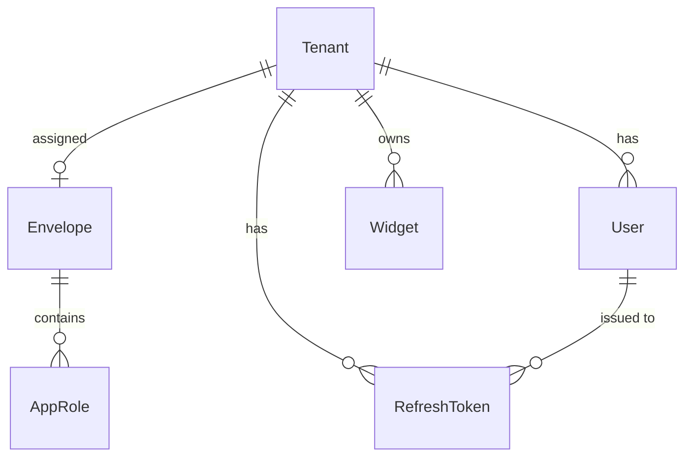

# Tessera — Database Tables

> 📐 **Architecture**: see **[`docs/ARCHITECTURE.md`](ARCHITECTURE.md)** — the single source of truth for how the system fits together. This file is a focused reference for the database schema (PostgreSQL, database `tessera_platform`).

The schema has **7 application tables** plus EF Core's `__EFMigrationsHistory` bookkeeping table. They split into two groups:

- **Platform-level** (not tenant-scoped, no `TenantId`): `Tenants`, `Envelopes`, `AppRoles`, `AdminUsers`
- **Tenant-scoped** (marked `IsMultiTenant()` → Finbuckle adds a `TenantId` column + global query filter): `Widgets`, `Users`, `RefreshTokens`

---

## Platform-level tables

### `Tenants`

A workspace/company using the platform. Doubles as the Finbuckle `ITenantInfo` (see ARCHITECTURE.md §3). Serves as the Finbuckle tenant store via `DbTenantStore`.

| Column | Type | Notes |
|---|---|---|
| `Id` | text | **PK** — internal key, e.g. `"alpha"` |
| `Identifier` | varchar(200) | **unique** — external lookup key sent in the `X-Tenant-Id` header, e.g. `"alpha-corp"` |
| `Name` | varchar(200) | display name |
| `ConnectionString` | text | nullable — currently unused (single shared DB) |
| `EnvelopeId` | uuid | nullable FK → `Envelopes.Id` — envelope assigned by a superadmin |
| `CreatedAt` | timestamptz | |

**Indexes:** `IX_Tenants_Identifier` (unique on `Identifier`).

### `Envelopes`

A bundle of roles + their actions, created by a superadmin and assigned to a tenant. Defines which roles a tenant can assign to its users.

| Column | Type | Notes |
|---|---|---|
| `Id` | uuid | **PK** |
| `Name` | varchar(100) | **unique** |
| `Description` | varchar(500) | nullable |
| `CreatedAt` | timestamptz | |

**Indexes:** `IX_Envelopes_Name` (unique on `Name`).

### `AppRoles`

A role inside an envelope. The `Actions` column lists the Tessera capabilities the role is allowed — **catalog only today, not enforced** (see ARCHITECTURE.md §13).

| Column | Type | Notes |
|---|---|---|
| `Id` | uuid | **PK** |
| `EnvelopeId` | uuid | **FK** → `Envelopes.Id`, cascade delete |
| `Name` | varchar(100) | unique per envelope (`EnvelopeId` + `Name`) |
| `Actions` | text[] | action catalog, e.g. `create_widget`, `edit_widget`, `manage_users` |

**Indexes / constraints:** `IX_AppRoles_EnvelopeId_Name` (unique on `{EnvelopeId, Name}`) · `FK_AppRoles_Envelopes_EnvelopeId` (cascade delete).

### `AdminUsers`

Platform-level superadmin accounts (no tenant binding). Authenticate via `/admin/auth/login` — different table from tenant `Users` (see ARCHITECTURE.md §6).

| Column | Type | Notes |
|---|---|---|
| `Id` | uuid | **PK** |
| `Email` | varchar(256) | **unique** |
| `PasswordHash` | text | bcrypt |
| `CreatedAt` | timestamptz | |

**Indexes:** `IX_AdminUsers_Email` (unique on `Email`).

---

## Tenant-scoped tables

### `Widgets`

The **placeholder demo resource** — a "todo" equivalent used to prove tenant isolation, auth, and RBAC work end-to-end. Not a product feature (see ARCHITECTURE.md §3).

| Column | Type | Notes |
|---|---|---|
| `Id` | uuid | **PK** |
| `TenantId` | text | set by Finbuckle — global query filter |
| `Name` | varchar(200) | |
| `Description` | varchar(1000) | nullable |
| `CreatedAt` | timestamptz | |

### `Users`

Tenant-scoped users. The first user to register in an empty workspace becomes its `Admin` (bootstrap rule, ARCHITECTURE.md §6).

| Column | Type | Notes |
|---|---|---|
| `Id` | uuid | **PK** |
| `Email` | varchar(256) | indexed |
| `PasswordHash` | text | bcrypt |
| `Role` | text | from the tenant's envelope, or the built-ins `Admin` / `User` |
| `TenantId` | text | set by Finbuckle — global query filter |
| `CreatedAt` | timestamptz | |

**Indexes:** `IX_Users_Email` (non-unique — the same email may exist in different tenants).

### `RefreshTokens`

Single-use refresh tokens for the access/refresh flow. No revocation endpoint yet (see ARCHITECTURE.md §13).

| Column | Type | Notes |
|---|---|---|
| `Id` | uuid | **PK** |
| `UserId` | uuid | indexed — FK to `Users.Id` (by convention, no FK constraint) |
| `Token` | varchar(512) | |
| `ExpiresAt` | timestamptz | |
| `IsRevoked` | boolean | |
| `CreatedAt` | timestamptz | |
| `TenantId` | text | set by Finbuckle — global query filter |

**Indexes:** `IX_RefreshTokens_UserId`.

---

## EF Core bookkeeping

### `__EFMigrationsHistory`

Created and managed by EF Core — records which migrations have been applied. Not an application table; don't modify it by hand.

---

## Migration history

| Migration | Adds |
|---|---|
| `20260727155941_InitialCreate` | `Widgets` |
| `20260727161156_AddAuthTables` | `Users`, `RefreshTokens` |
| `20260728124717_AddUserRole` | `Role` column on `Users` |
| `20260813120719_AddPlatformAdmin` | `AdminUsers`, `Envelopes`, `Tenants`, `AppRoles` |
