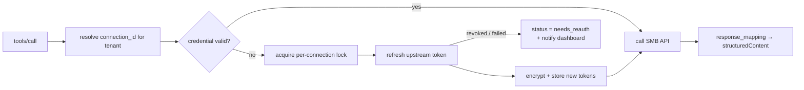
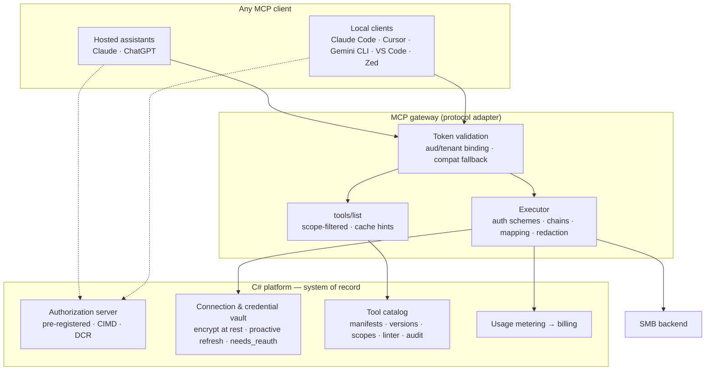

# Onward — R&D: From a Working Demo to a Universal, Plug-and-Play MCP

> **Question this document answers:** what has to change for Tessera to be the
> thing it's pitched as — *an SMB plugs in its existing tools, and its customers
> use them through any AI assistant* — rather than a demo that works with one
> assistant against one local fixture?
>
> **Method:** (1) read the actual implementation and inventory what is
> tenant-generic vs. hardcoded, (2) check every claim about client compatibility
> against the ecosystem's own documentation as of **September 2026**, (3) turn
> the delta into workstreams with a sequence.
>
> **Status:** research + recommendation. No code changed by this document.
> **Author's stance:** two of your assumptions are wrong, and the one you didn't
> state is the expensive one.
>
> **Related:** [`../FLOW.md`](../FLOW.md) (what exists today),
> [`../mcp/README.md`](../mcp/README.md) (product model),
> [`../CONCERNS.md`](../CONCERNS.md) (open concerns, esp. §14/§15).

---

## 0. Verdicts up front

| Your assumption | Verdict | One-line reason |
|---|---|---|
| "Tessera is only compatible with Claude web" | **Mostly false — but you're incompatible with clients you haven't tried** | Nothing in the gateway is Claude-specific. Two *auth configuration choices* (CIMD-only registration, strict `aud == resource`) happen to fit Claude + ChatGPT and likely exclude Cursor, Gemini CLI, Copilot Studio, Devin and JetBrains. |
| "...and that too rigidly coupled with our local SMB" | **False for the engine, true for four config values and one missing subsystem** | The manifest engine has zero tenant-specific code. What's actually coupled: dev defaults for the host override + the credentials env map, the in-repo stub, a hardcoded `X-Api-Key` auth scheme, and `execution.type = "http"` only. |
| *(unstated)* "The hard part is protocol compatibility" | **False.** | Protocol surface is close to done. The hard parts are **tool semantics**, **the multi-tenant credential lifecycle**, and **how a non-technical SMB produces a good manifest**. |
| *(unstated)* "The gateway must be Python" | **Worth re-opening.** | C# is now a Tier-1 MCP SDK on the current revision. Keeping Python is still the right *near-term* call, but the reason for it has weakened (see §5). |

**The short version:** you are one authentication endpoint, one credential store,
and one auth-scheme abstraction away from "universal". The expensive work after
that is not compatibility — it is everything that lets customer #2 onboard
themselves without you.

---

## 1. Challenging the assumptions with evidence

### 1.1 "Only compatible with Claude web"

Let's separate what *is* Claude-specific from what only *looks* it.

**Nothing in the gateway knows about Claude.** `apps/mcp-server` is a generic
Streamable HTTP MCP server: low-level `Server` per tenant, `tools/list` from the
manifest catalog, RFC 9728 protected-resource metadata, RFC 8707 audience-bound
token validation. There is no client-specific branch anywhere. By construction
it should work with any conformant client.

**So why does it feel Claude-only?** Because three auth decisions narrow the
field, and we only ever tested against the one client that survives all three:

1. **Registration is CIMD-only.** There is no `registration_endpoint`
   (`ClientIdMetadataService` fetches a metadata document; OpenIddict has no DCR —
   openiddict-core#2404 is still open). Per the current spec's client-registration
   priority order, a client that doesn't support CIMD *falls back to DCR*, and if
   there's no DCR endpoint, it falls back to "prompt the user" — which for a
   hosted assistant means "cannot connect".
2. **Audience validation is strict and unconditional.** `TokenVerifier` decodes
   with `verify_aud=True, audience=<the tenant's resource URL>`. If a client never
   sends the RFC 8707 `resource` parameter, the AS never mints a token with that
   `aud`, and **every call from that client is rejected — even though its token is
   perfectly valid**. Note this is now a client MUST per 2026-07-28, but adoption
   is thin (§1.3).
3. **OAuth is the only credential path.** That's correct for hosted assistants
   and we should keep it (ChatGPT refuses custom API keys outright), but it means
   local/CLI clients that prefer a static header have no path in.

> **Don't skim point 1.** The registration mechanism is the least intuitive part
> of the whole stack — the difference between "the spec's future" and "the
> ecosystem's present" — and it is the cheapest thing to fix. Full walkthrough in
> [Appendix A](#10-appendix-a--client-registration-explained).

**The uncomfortable corollary:** we also have not tested the wire that Claude web
actually uses. Claude's hosted connectors are still on the **initialize era**
revision, while our test suite exercises the stateless 2026-07-28 `params._meta`
envelope. It works because the SDK negotiates both — but *we have never asserted
it*. Our green tests do not cover our only successful client.

### 1.2 "...rigidly coupled with our local SMB"

The manifest engine is genuinely generic. Here is the complete list of places
where "Acme Dental" is baked in, with the severity of each:

| # | Coupling | Where | Cost to remove |
|---|---|---|---|
| 1 | `SMB_HOST_OVERRIDES` defaults to `api.acmedental.test → 127.0.0.1:9100` | `config.py` | One env var. Compose already overrides it. **Trivial.** |
| 2 | `CREDENTIALS` defaults to a map containing `acme-dental/booking-api-key` | `config.py` | **Real.** There is no credential store, so every tenant's secret lives in an env var. Adding tenant #2 means editing deploy config. |
| 3 | `stub_backend/` deployed in the same compose file | `docker-compose.yml` | Split dev/prod compose. **Trivial.** |
| 4 | `execution.auth` supports `api_key` only, and hardcodes the header as `X-Api-Key` | `http_executor.py` | **Real and immediate.** An SMB whose API wants `Authorization: Bearer`, HTTP Basic, OAuth2 client-credentials, or a custom key header like `X-Company-Key` simply cannot be onboarded. |
| 5 | `execution.type` is `Literal["http"]` | `manifest/models.py` | Real but acceptable for v1 — it's an explicit contract limit, not a hidden one. |
| 6 | Nothing can *create* a manifest except a developer/API call | platform + portal | **Real.** There is no wizard or import. Tenant #2's tools get written by you. |

So: **five of six items are configuration or a small refactor.** The coupling is
not architectural. What's genuinely missing is a credential store (#2) and a
self-service onramp (#6) — and neither is about MCP.

### 1.3 Where the ecosystem actually is (September 2026)

From the [Zuplo MCP compatibility matrix](https://zuplo.com/learn/mcp/compatibility)
(clients verified July 31, 2026, every cell sourced) plus the spec's own release
notes. Two facts dominate everything else:

> **"Of the 22 rows here, 2 reach 2026-07-28: MCP Inspector 2.0.0, MCP Python SDK
> 2.0.0. 8 publish an older revision, 12 publish none at all... So build your
> server to prefer the current revision and still accept the initialize
> handshake."**

> **DCR is deprecated in favour of CIMD** (2026-07-28, PR #2858) — but with a
> **minimum twelve-month** deprecation window, and clients are the lagging side.

Client registration reality (⚠️ = a real constraint on us):

| Client | OAuth flow | DCR (RFC 7591) | CIMD (metadata doc) | Sends `resource` | Custom headers |
|---|---|---|---|---|---|
| claude.ai / Desktop / mobile | Yes | Yes | Yes | Yes | Partial (beta allowlist) |
| ChatGPT connectors/apps | Yes | Yes | Yes | Yes | ⚠️ **No** |
| Claude Code | Yes | Yes | Yes | Yes | Yes |
| **Cursor** | Yes | Yes | ⚠️ Unknown (community says no) | Unknown | Partial |
| **Gemini CLI** | Yes | Yes | ⚠️ **No** | Yes | Yes |
| **VS Code / Copilot** | Yes | Yes | ⚠️ Partial | ⚠️ **Partial** (only after PRM discovery) | Yes |
| **Microsoft Copilot Studio** | Yes | Yes | ⚠️ Unknown | Unknown | Unknown |
| **Devin CLI** | Yes | Yes | ⚠️ Unknown | Yes | Yes |
| **Zed** | Yes | Yes | Yes | Yes | Yes (but ⚠️ no pre-registered ID) |
| **JetBrains AI** | Unknown | Unknown | Unknown | Unknown | Unknown |
| MCP Python SDK 2.0.0 | Yes | Yes | Yes | Yes | Yes |

Read that as: **DCR is the broadest registration mechanism in the field right
now; CIMD is the future but the thinner one.** We built the future and skipped
the present.

Three more findings that decide design, all from the same matrix:

- **`resource` is not universal.** VS Code sends it only *after* discovering RFC
  9728 PRM (we publish PRM, so VS Code is fine — but only by luck of that
  ordering). Cursor's behavior is undocumented and community reports say it needs
  care. Our strict `aud` check converts "client didn't send `resource`" into
  "client can never connect".
- **Static credentials split the field, and not in our favour.** ChatGPT refuses
  machine-to-machine grants, service accounts, JWT bearer assertions, custom API
  keys and customer-supplied certificates, and offers no custom headers at all.
  claude.ai refuses the M2M grant too but has a beta header path. So API-key auth
  reaches *neither* hosted assistant reliably. **Our OAuth-first design was the
  right call** — this validates it rather than contradicting it.
- **`iss` validation is nearly unimplemented downstream.** We emit RFC 9207 `iss`
  and advertise the capability (correct); only the Python SDK 2.0.0 client
  actually validates it. Don't build security that *depends* on the client
  validating.

### 1.4 The assumption you didn't state, and it's the expensive one

The protocol is the easy part. The three things that actually stand between here
and "universal" are:

1. **Tool semantics.** You already have a live failure on file: Claude *refused*
   to call `list_appointments` because the description promised "the current
   patient's upcoming appointments" while the schema accepted an arbitrary
   `patient_name`. That is not a bug in our transport; it is a product defect in
   how manifests are authored, and it will happen for every tenant you onboard
   until tool shape is a designed thing.
2. **The credential lifecycle.** Today a tenant's secret is an env var read at
   boot. Real SMB APIs expire tokens in 30–60 minutes, and an agent fires tools
   in parallel — the first refresh succeeds, the provider invalidates the old
   refresh token, and the other four calls fail. Get this wrong once and the
   customer's integration is disconnected.
3. **The writer-side onramp.** "Plug and play" is a claim about the *SMB's*
   experience. Right now it's your experience.

---

## 2. Inventory: what is already universal

Worth stating plainly, because it narrows the work:

| Capability | State | Note |
|---|---|---|
| Manifest-driven, per-tenant tool catalog | ✅ Done | Zero tenant-specific code in the gateway |
| Path-based tenant addressing | ✅ Done | `/t/{slug}/mcp`, exactly the v1 decision |
| Per-tenant token audience binding | ✅ Done | RFC 8707 `resource` → `aud`; the isolation boundary |
| RFC 9728 PRM + AS discovery | ✅ Done | Verified live |
| Stateless 2026-07-28 core | ✅ Done | Via SDK v2 |
| Dual-era 2025 clients | ⚠️ Works, untested | SDK negotiates; no test asserts the initialize path |
| Provider-agnostic executor | ⚠️ Partial | `http` only; `api_key` only; hardcoded header name |
| Credential isolation from the model | ✅ Correct by design | We never pass the *client's* token upstream — avoids the confused-deputy anti-pattern |
| Per-tool scopes | ❌ Not enforced | `required_scopes` on manifests is ignored; gateway hardcodes `["tools"]` |
| Usage metering → billing | ❌ Not built | Emit from day one was the decision (Q8); not done |
| Shared manifest cache | ❌ Per-process only | 60s in-memory TTL, inconsistent across replicas |
| Manifest versioning / audit | ❌ Not designed | CONCERNS §15 |
| Self-service manifest authoring | ❌ Not built | Wizard / OpenAPI import / connectors |

---

## 3. Gap register

Priority = what blocks the *next paying tenant*, not what is most interesting.

| # | Gap | Blocks | Priority |
|---|---|---|---|
| G1 | No DCR endpoint → clients that don't do CIMD can't register | Cursor, Gemini CLI, Copilot Studio, Devin, JetBrains | **P0** |
| G2 | Strict `aud` only → clients that don't send `resource` get rejected | Unknown/mixed clients; fragile | **P0** |
| G3 | No credential store; secrets in env | **Tenant #2 of any kind** | **P0** |
| G4 | Executor auth breadth (`bearer`/`basic`/`oauth2`, custom header name) | Any SMB with a non-`X-Api-Key` API | **P0** |
| G5 | Upstream error bodies echoed to the model verbatim | Secret/PII leak into model context + logs | **P0** |
| G6 | Dual-era conformance untested | Silent breakage of our only working client | **P0** |
| G7 | Tool shape is ungoverned → model refusals / wrong-tool selection | Every tenant, from the first | **P0** |
| G8 | Manifest `required_scopes` ignored | Per-user/per-role authorization; CONCERNS §14 | **P1** |
| G9 | In-process manifest cache | Multi-replica correctness + platform load | **P1** |
| G10 | No usage metering | Pricing, rate-limit policy, "which tools are used" | **P1** |
| G11 | `tools/list` sends no `ttlMs`/`cacheScope` | Needless refetch; poor prompt-cache stability | **P1** |
| G12 | Credential refresh (expiry, parallel-call races, `needs_reauth`) | Any OAuth-protected SMB API | **P1** |
| G13 | Manifest versioning + audit trail | Changing a live tenant's tools safely | **P1** |
| G14 | No self-service authoring (wizard/OpenAPI import) | SMB onboarding at all | **P1** |
| G15 | End-user (Jane) identity | The actual product moat | **P1 (product P0)** |
| G16 | PostgreSQL integration tests (InMemory only) | Confidence in anything above | **P2** |
| G17 | Production hosting (tunnel → domain, scale-out) | Everything at >1 customer | **P2** |

---

## 4. Workstreams

### W1 — Client universality (P0)

**W1.1 Add a DCR endpoint (`/connect/register`, RFC 7591).** Highest
leverage-per-line in the whole list. OpenIddict ships no DCR (openiddict-core#2404),
so this is a custom endpoint that creates an `OpenIddictApplication` and returns
`201` — same pattern we already used for CIMD. Details that matter:

- Advertise `registration_endpoint` in the discovery document (we already amend
  that document for CIMD — same hook).
- Honour `application_type` (`native` for loopback redirects). The spec made this
  a MUST for DCR clients because omitting it defaults to `web` and breaks
  localhost redirects.
- Issue **no secret** for public clients; loopback redirects matched
  port-agnostically, as `ClientIdMetadataService` already does.
- Keep CIMD preferred (spec priority: pre-registered → CIMD → DCR), so Claude and
  ChatGPT keep using their published identity and we don't regress.
- Hardening, because this widens the attack surface: SSRF-safe validation of any
  client-supplied URL, strict rate limiting, a cap on registered clients per
  window, and periodic pruning of never-used registrations. Note
  CVE-2026-45609 affects OAuth libraries with DCR enabled that fetched untrusted
  URLs without internal-network checks — and CIMD fetch needs the same SSRF
  controls. Our CIMD fetch should get an explicit private-IP/loopback deny list.

**W1.2 Make audience binding tolerant without weakening isolation.**
Today: reject unless `aud == this tenant's resource URL`. Proposed:

- Publish PRM at the canonical path **and** at the root, so clients that only
  send `resource` after discovery (VS Code) always find it.
- Accept a token as tenant-bound when **either** `aud` matches the requested
  tenant's resource **or** a dedicated `tenant`/`workspace` claim (minted by our
  AS) matches the requested tenant. The comparison stays server-side against
  server-known values — the URL alone is never trusted, and no client input
  decides the tenant.
- Keep a `RESOURCE_AUDIENCE_MODE=strict|compat` flag so we can prove what the
  tolerance costs (and tighten it as the ecosystem catches up).

**W1.3 Test the wire we actually ship.** Add a conformance suite covering: the
initialize-era handshake (what claude.ai sends), a 2025-11-25 client, the
2026-07-28 stateless shape, and `server/discover` — which is *optional to call
but mandatory to implement*. Today's tests cover exactly one of those.

**W1.4 Static-header mode for local clients.** `MCP_AUTH_MODE=static` (loopback
only, documented as unreachable from hosted assistants) lets Claude Code, Zed and
`mcp-remote` connect without an OAuth round trip. Do **not** promote this as the
product path: ChatGPT has no custom headers, and Cursor's behavior here is a
confirmed bug (it starts OAuth first and never sends the header).

### W2 — Credential & connection vault (P0 — the real unblocker)

This is the single subsystem that turns "one fixture" into "many tenants".

Replace the `CREDENTIALS` env map with a platform-side `Connections` entity:

```
Connections(TenantId, ConnectionId, Kind, BaseUrl, AuthScheme,
            SecretCiphertext, RefreshCiphertext, ExpiresAt,
            Status: {active, needs_reauth, disabled}, LastUsedAt)
```

- **Encrypt at rest** (AES-GCM envelope; KMS-held master key in production,
  env-var key for v1). Decrypt only inside the executor's call path. Never log,
  never place in a tool result, never place in model context.
- **Never pass the caller's token upstream.** We already do this correctly —
  keep it. The executor uses the tenant's own stored credential, which is what
  prevents confused-deputy vulnerabilities.
- **Proactive refresh, not lazy refresh.** Refresh 60–180s before expiry on a
  background worker, plus a just-in-time check with a small safety buffer.
- **Per-connection distributed lock around refresh.** Agents call tools in
  parallel; without the lock, concurrent refreshes invalidate each other and
  disconnect the customer.
- **`needs_reauth` state surfaced to the dashboard**, and a typed MCP error on
  call ("the Acme Dental connection needs to be re-authorized") instead of a bare
  500. Silent 500s after a revoked grant are how integrations die quietly.
- Manifests stop carrying `vault://…` strings resolved from env and instead
  reference `connection_id`. (Keep `vault://` as the wire form if you like, but
  resolve it from the vault.)



### W3 — Executor breadth (P0/P1)

The executor is where "universal" is won or lost, because every SMB's API is a
different shape.

| Change | Why |
|---|---|
| Declare `url` and `method` as explicit fields | They're currently free-form extras (`extra="allow"`), so a typo fails at call time instead of validation time |
| Auth schemes: `none`, `api_key` (**configurable header/query name**), `bearer`, `basic`, `oauth2_client_credentials`, `oauth2_authorization_code` | `X-Api-Key` hardcoded today is an immediate blocker for most APIs |
| Allow `body_template` on GET/DELETE | Some APIs take bodies on DELETE; silently dropping it is a footgun |
| Step chains (`execution.type: "http_chain"`) | "Book, then notify" is the normal shape of a useful SMB tool |
| Pagination contract (cursor from response → next request) | Stops list tools from burning the model's context |
| Per-manifest timeouts + bounded retries with idempotency keys | Booking a duplicate appointment on a retry is worse than failing |
| Declared `outputSchema` + `structuredContent` | Typed results validate better and consume fewer tokens |
| Response size governance (truncate/summarize) | The model's context is the scarce resource |
| **Redact upstream error bodies** | G5: `response.text[:500]` is currently forwarded to the model. An upstream 401 body can contain a token; a 400 can contain PII. Map to a safe taxonomy instead. |

Error taxonomy to standardize (each maps to an actionable model-visible message):
`upstream_unavailable`, `connection_needs_reauth`, `invalid_arguments`,
`not_permitted`, `rate_limited`, `upstream_rejected`. Never a raw upstream body.

### W4 — Tool semantics (P0 for the product)

This is the differentiator, and the place where the current fixtures are actively
wrong.

**W4.1 Two canonical tool shapes, and no third.**

- **Self-scoped tools** (Jane's view): *no identity parameter*. Identity comes
  from the token subject → the tenant's record mapping. `list_my_appointments`,
  `book_my_appointment`, `cancel_my_appointment`. The SMB backend is called with
  the resolved person, server-side.
- **Staff-scoped tools** (practice management): explicitly named and described as
  staff operations, e.g. `staff_list_patient_appointments`, and gated behind a
  scope/role only staff hold.

The current `list_appointments(patient_name)` is neither, which is precisely why
Claude refused it. Fix the seeded Acme manifests to the two shapes and delete the
ambiguous one. **A manifest whose description and schema disagree is a bug, and
should fail validation.**

**W4.2 Enforce `required_scopes`.** The spec explicitly permits `tools/list` to
vary by the authorization presented, which is exactly the mechanism for
role-scoped tool visibility:

- Filter `tools/list` to tools whose `required_scopes` the caller holds.
- Return `403 insufficient_scope` with a `scope=` challenge on call.
- Mark such responses `cacheScope: "private"` and set a deliberate `ttlMs`.

This closes half of CONCERNS §14 without inventing a new authorization plane.

**W4.3 Use the protocol features that solve our known problems.**

- **MRTR (`resultType: "input_required"`) for confirm-before-booking** and for
  missing parameters. This replaces "the model guessed a patient name" with "the
  server asked". Also the right shape for destructive operations, where the spec
  expects a human in the loop.
- **`annotations`** (`readOnlyHint`, `destructiveHint`, `idempotentHint`, `title`)
  so hosts can render approvals sensibly. (Clients must treat these as untrusted —
  they're UX hints, not security.)
- **`x-mcp-header`** to mirror a parameter (e.g. tenant) into an HTTP header so
  the edge can route/meter without parsing bodies. Primitive types only.
- **Deterministic tool ordering** + `ttlMs`/`cacheScope` on `tools/list` for
  prompt-cache stability.

**W4.4 Namespacing and tool-count discipline.** Per Anthropic's guidance: prefer
a few high-impact, consolidated tools over one-per-endpoint (a `search_contacts`
beats a `list_contacts`), namespace by service (`acmedental_book_appointment`),
and keep the per-tenant tool count small. Spec rule for names: 1–128 chars from
`A-Za-z0-9_-.`, no spaces, unique within the server.

**W4.5 A manifest linter + a tool-selection evaluation harness.** Two pieces of
tooling that make onboarding quality a measurable thing rather than a hope:

- **Linter** (blocking, in the platform): valid JSON Schema 2020-12; name charset
  and length; non-empty description; description/schema consistency (no
  "current patient" description with an identity parameter); tool count budget;
  destructive tools annotated; auth scheme resolvable.
- **Eval harness**: seeded prompts → expected tool(s) → measure selection
  accuracy per tenant, using the agent-in-the-loop loop Anthropic describes
  (generate tasks, run, read transcripts, fix descriptions). Run it on manifest
  change. This is genuinely a moat: *nobody else can tell an SMB whether its
  manifests are understandable by a model.*

### W5 — Writer-side onramp (P1)

"Plug and play" is a claim about the SMB's effort.

1. **Wizard** — form-driven (name, method, URL, params, auth, sample response) →
   draft manifest. Reuses the `manage_tools` CRUD that already exists.
2. **OpenAPI import** → draft manifests: one tool per selected operation, names
   normalized from `operationId`, schemas from request/response bodies, auth from
   `securitySchemes`. Then the linter (§W4.5) gates publish.
3. **Test-before-publish**: a sandbox call against the configured connection,
   executed by the gateway with a sample argument set, showing the mapped result.
   This catches the wrong-URL / wrong-header class of error before a customer sees
   it.
4. **Tier-1 connectors** last, demand-driven, as already decided — each vertical
   is a manifest on the generic schema.

### W6 — Identity planes and delegation (P1 → product P0)

Keep the two planes separate, as CONCERNS §14 insists: workspace RBAC answers
*"who can configure Tessera"*; tool authorization answers *"who may execute this
SMB operation"*. Do not collapse them.

- **Near term:** the tool-scope filtering in W4.2 gives per-role tool visibility
  on the MCP surface. Add an explicit consent screen that names the person and the
  data scope ("Allow Claude to book and view **your** appointments at Acme
  Dental"), which is both better UX and what the spec's human-in-the-loop
  expectation asks for.
- **Jane:** the mirror-account model is fine, but the missing piece is the
  mapping `(tenant, external person) → local subject`, plus self-scoped tools
  that never accept an identity argument. Without that mapping, every tool is
  staff-shaped and the moat isn't built.
- **Federation / EMA:** the Enterprise-Managed Authorization extension went
  **stable** in June 2026 — the IdP becomes the authority, the client gets an
  ID-JAG during SSO and exchanges it for an access token at the MCP server's AS,
  with no per-server consent screen. Adopters include Anthropic (Claude, Claude
  Code, Cowork), VS Code, and Okta (via Cross App Access); servers include Asana,
  Atlassian, Canva, Figma, Granola, Linear, Supabase. **This is the standardised
  version of the "SMB-as-IdP federation" upgrade already sketched in the design.**
  It matters most for larger SMBs on Okta/Entra; for a 3-chair dental practice it
  is not the near-term path. Recommendation: implement the near-term mirror +
  scoped-tools model, and treat EMA as the design target for the federation
  interface so we don't invent a bespoke one.

### W7 — Scale, metering, ops (P1/P2)

- **Shared manifest cache** (Redis/ValKey) — the 60s in-process TTL is
  inconsistent across replicas and multiplies platform load by replica count.
- **Per-tenant/per-tool rate limits at the edge**, using the now-mandatory
  `Mcp-Method`/`Mcp-Name` headers (the spec added them precisely so gateways,
  rate limiters and WAFs can meter without parsing JSON) plus `x-mcp-header` for
  tenant.
- **Usage metering** — the decision was "emit from day one" (Q8). Nothing is
  emitted. Without it there is no pricing, no rate-limit policy, and no answer to
  "which tools do customers actually use".
- **Observability** — correlate MCP request → tenant → connection → upstream
  call, with an explicit redaction policy for tool arguments and responses.
- **Deployment** — retire the tunnel; a stable domain with path-based tenancy.
  Hosted options worth evaluating if we'd rather not run the gateway: Cloudflare
  Workers (Agents SDK supports the current spec from day zero), AWS Bedrock
  AgentCore, Prefect Horizon, mcp-use.
- **PostgreSQL-backed tests** — the InMemory gap (CONCERNS §23) undermines
  confidence in exactly the things above (filtered indexes, concurrency, raw SQL).

### W8 — Manifest lifecycle (P1, blocking for live tenants)

- **Versioning**: manifests get revisions; publishing bumps a catalog version.
- **Cache invalidation**: version in the `tools/list` response + short `ttlMs`;
  clients refetch on change.
- **Tool removal semantics**: tokens are tenant-scoped, not tool-scoped, so
  removal is enforced at `tools/list`/`tools/call` (unknown tool → error). That's
  acceptable — but write it down, and audit it.
- **ChatGPT nuance**: published apps use a **frozen tool snapshot**, so adding or
  editing a tool requires an admin refresh/re-publish. Surface that in the
  dashboard when a tenant's manifests change.
- **Audit trail** (D4): who changed which tool, when.

---

## 5. Target architecture — and the Python-vs-C# question, re-opened

The dependency that justified the language split has weakened. The original
decision was "Python, because it has the most mature MCP SDK". As of 2026-07-28,
**C# is a Tier-1 SDK on the current revision**, alongside TypeScript, Python and
Go.

| Option | Pros | Cons | Verdict |
|---|---|---|---|
| **A. Keep the Python gateway, harden it** | Fastest; protocol SDK churn stays isolated from the platform release; already live-verified | Two deploys, a duplicated manifest contract, an extra HTTP hop, a second token verifier | ✅ **Recommended now** |
| **B. Collapse the gateway into the C# platform** | One deploy, one contract, one auth stack, no `/internal/gateway/manifests` hop, no duplicate verifier | Protocol churn coupled to platform releases; rewrites a working, verified component | ⏸️ Re-evaluate at ~6 months |
| **C. Per-connection URL tokens** (HMAC'd token in the path, à la [Truto's multi-tenant pattern](https://truto.one/blog/how-to-architect-a-multi-tenant-mcp-server-for-enterprise-b2b-saas/)) | Binds a tenant even for clients that never send `resource`; instant revocation; no session | The URL becomes a bearer credential; **defeats per-user OAuth consent** if used as the primary boundary | ⚠️ Adopt *only* as a fallback for clients that can't do `resource`, never as the main boundary |

Whichever way B goes, fix the **duplicated contract** regardless: publish one JSON
Schema for the manifest (`packages/contracts/` was always the plan) and generate
or validate the pydantic models and the C# entity from it. Right now the contract
exists twice, and the Python side even treats `url`/`method` as
`extra="allow"` — the two will drift, silently.



---

## 6. Sequenced plan

**Weeks 1–3 — "make it safe and honest" (all P0, mostly small)**
1. Executor auth breadth: configurable api-key header, `bearer`, `basic`,
   `oauth2_client_credentials` + explicit `url`/`method` fields.
2. Redact upstream error bodies; introduce the error taxonomy (G5).
3. Dual-era conformance tests + a `server/discover` assertion (G6).
4. `tools/list` cache hints + deterministic ordering (G11).
5. Rewrite the seeded Acme manifests to the two canonical tool shapes; add a
   blocking manifest linter (G7).
6. DCR endpoint + discovery advert (G1).

**Weeks 4–10 — "make it multi-tenant"**
7. Connection/credential vault + proactive refresh + per-connection lock +
   `needs_reauth` (G3, G12).
8. Audience compat mode + PRM at the root (G2).
9. Per-tool scopes: filtered `tools/list` + `403 insufficient_scope` (G8).
10. Usage metering to the platform (G10) and a shared manifest cache (G9).
11. Split dev/prod compose: stub out, real backends in (part of §1.2).

**Months 3–6 — "make it self-serve and scalable"**
12. Manifest wizard → OpenAPI import → test-before-publish (G14).
13. Manifest versioning + audit trail + cache invalidation (G13).
14. PostgreSQL testcontainers; observability with redaction (G16).
15. Production hosting: stable domain, multi-replica, edge rate limits.
16. Tool-selection evaluation harness, wired to manifest publish.

**Months 6–12 — "build the moat"**
17. Jane identity: person mapping + self-scoped tools end to end (G15).
18. EMA spike for SMB-IdP delegation (design target, if Okta/Entra-class SMBs
    appear in the pipeline).
19. Tier-1 connectors + Tier-3 function executor, demand-driven.
20. Re-evaluate Option B (collapse into C#).

---

## 7. Decisions I need from you

| # | Question | My recommendation |
|---|---|---|
| D1 | Add DCR, or wait for CIMD adoption? | **Add DCR now.** It is the only way to reach Cursor, Gemini CLI, Copilot Studio, Devin and JetBrains, and the spec keeps DCR for ≥12 months. Keep CIMD preferred so we don't regress Claude/ChatGPT. |
| D2 | Should `aud` be strict or tolerant? | **Tolerant-but-server-verified, behind a flag.** Never derive the tenant from client input. |
| D3 | Keep Python, or collapse into C#? | **Keep Python now**, re-evaluate at ~6 months. Meanwhile de-duplicate the manifest contract. |
| D4 | Are the Acme tools self-scoped or staff-scoped? | **Both, as two named shapes** — never one ambiguous tool. This is what actually failed in testing. |
| D5 | Per-tool scopes via `tools/list` filtering, or a separate authorization service? | **Filter `tools/list`.** The spec explicitly supports it and it needs no new component. |
| D6 | When does the credential vault get built? | **Before tenant #2, full stop.** The env map is the thing that makes us "a demo with one SMB". |
| D7 | Is EMA in scope? | **Not now, yes as the interface design target** for federation — don't invent a bespoke SMB-SSO protocol. |
| D8 | Do we keep the tunnel? | **Only for development.** Any real customer needs a stable domain, per-tenant path, and a documented onboarding link. |

---

## 8. What we should deliberately *not* build

- **Roots, Sampling, Logging** — deprecated in 2026-07-28; new implementations
  shouldn't adopt them. Logging/progress travel per-request via `_meta` or a
  request-scoped stream.
- **Legacy HTTP+SSE** as a new surface — deprecated with a 12-month offramp. Dual
  era is about the *handshake*, not the transport.
- **One tool per API endpoint.** Anthropic's guidance is explicit that more tools
  is not better; consolidate around workflows or the model gets confused and the
  context budget dies.
- **Static API keys as a hosted-assistant path.** ChatGPT refuses them outright;
  claude.ai offers only a beta allowlisted header path. OAuth stays the product
  path.
- **Passing the client's token to the SMB backend.** Our design already avoids
  this; make it an explicit, tested invariant.
- **A bespoke SMB-SSO protocol** while an EMA-shaped standard exists.

---

## 9. Sources

Specification and release material
- MCP 2026-07-28 release notes — <https://blog.modelcontextprotocol.io/posts/2026-07-28/>
- MCP Tools (2026-07-28): tool names, `inputSchema`/`outputSchema`, annotations,
  `x-mcp-header`, MRTR, `ttlMs`/`cacheScope`, per-authorization tool sets —
  <https://modelcontextprotocol.io/specification/2026-07-28/server/tools>
- Authorization changes: DCR deprecated, `iss` MUST, credential binding —
  <https://ssojet.com/blog/mcp-authorization-spec-2026-07-28-what-changed>
- Enterprise-Managed Authorization (stable) —
  <https://blog.modelcontextprotocol.io/posts/enterprise-managed-auth/>

Client compatibility
- Zuplo MCP compatibility matrix (22 clients, every cell sourced; verified July
  2026) — <https://zuplo.com/learn/mcp/compatibility>
- Cursor CIMD support thread (community reports no CIMD; VS Code works) —
  <https://forum.cursor.com/t/mcp-oauth-cimd-support-plans-and-timelines/148096?page=2>
- OpenAI developer mode + MCP apps (refresh-token requirement) —
  <https://help.openai.com/en/articles/12584461-developer-mode-and-mcp-apps-in-chatgpt>

Tool and server design
- Anthropic, *Writing effective tools for AI agents* —
  <https://www.anthropic.com/engineering/writing-tools-for-agents>
- Multi-tenant MCP architecture: per-account URL scoping, credential opacity,
  proactive refresh, distributed refresh locks —
  <https://truto.one/blog/how-to-architect-a-multi-tenant-mcp-server-for-enterprise-b2b-saas/>

Platform dependencies
- OpenIddict DCR support request (open) —
  <https://github.com/openiddict/openiddict-core/issues/2404>
- MCP C# SDK (Tier 1) — <https://github.com/modelcontextprotocol/csharp-sdk>
- MCP Server Cards / discovery working group —
  <https://modelcontextprotocol.io/community/working-groups/server-card>

---

## 10. Appendix A — Client registration explained

> This appendix exists because "we're CIMD-only" reads like a technical detail and
> is actually the reason we can't serve several major clients. It is also the
> cheapest gap on the list to close.

### A.1 Why registration has to happen at all

When a client hits `/t/{tenant}/mcp`, our authorization server must eventually
issue it a token. To do that safely it has to know **who the client is**: which
redirect URI to deliver the authorization code to, whether the client is public
(no secret) or confidential, and what it is allowed to request.

It cannot take the caller's word for it. If any caller could assert
`redirect_uri=https://attacker.example`, that caller would harvest authorization
codes. So a trustworthy client identity has to be established somehow. There are
exactly three mechanisms, and they are **rungs on a fallback ladder**, not
mutually exclusive philosophies:

| Mechanism | How the AS learns the client | What our AS must expose |
|---|---|---|
| **Pre-registered** | Out of band — we paste the client id/secret into config | Nothing (it's data). This is what `tessera-local-dev` is. |
| **DCR** (RFC 7591) | The client `POST`s its metadata to us; we return a `client_id` | `registration_endpoint` in the discovery document |
| **CIMD** | The `client_id` **is** an HTTPS URL to a metadata document the client hosts; we fetch it on demand | `client_id_metadata_document_supported: true` |

**The spec's priority order for a client that supports everything**
(MCP Client Registration, 2026-07-28):

1. pre-registered credentials, else
2. **CIMD** — if the AS advertises `client_id_metadata_document_supported`, else
3. **DCR** — if the AS exposes a `registration_endpoint`, else
4. prompt the user.

CIMD is preferred and DCR is the safety net *beneath* it. Remove the net and any
client that can't do CIMD falls through to step 4 — which, for a hosted product
with no UI to collect a client ID, means "cannot connect".

### A.2 What that looks like for Tessera, concretely

Both clients read the same discovery document. The ladder diverges after that.

**Claude (works today):**

```
GET /.well-known/openid-configuration
  → client_id_metadata_document_supported: true        ← our CIMD amendment
GET /connect/authorize?client_id=https://claude.ai/...  ← cimd URL as the id
  → ClientIdMetadataService fetches + validates the document
  → 302 to the CIMD-declared redirect_uri with ?code=
```

**Cursor (fails today, and not for any protocol reason):**

```
GET /.well-known/openid-configuration
  → client_id_metadata_document_supported: true (~ignored: Cursor can't do CIMD)
  → looking for registration_endpoint ... ABSENT     ❌ rung missing
  → fell to: "prompt the user for a client ID"        ❌ hosted product can't
  → cannot connect
```

That is the entire failure. Not Streamable HTTP, not PKCE, not `resource`, not
MCP — **one absent field in a JSON document.**

And it is worse than "Cursor would be nice to have": the matrix records
**Gemini CLI as CIMD = No**, and **VS Code as CIMD = Partial**, with Cursor,
Copilot Studio, Devin and JetBrains all *unknown*. The Cursor forum thread has
users saying they are "stuck on claude code" for exactly this reason, and a
commenter states plainly: *"VS Code supports CIMD without issues, but currently
it is impossible to set it up using Cursor."*

### A.3 Why the spec deprecated DCR anyway

The move to CIMD is well-motivated — worth understanding, because these are the
reasons we were right to build CIMD first:

- **DCR is stateful.** Every registering client instance creates a row on the AS.
  (Cursor's own forum thread describes "so much clutter on our end from Cursor
  DCR" — that flourish is the sprawl.)
- **DCR credentials are bound to the issuing AS** (SEP-2352, new in this
  revision): if the authorization server changes, the client **must
  re-register**. CIMD clients are exempt — the `client_id` is a self-hosted URL
  that resolves the same way from any AS, which is why the spec calls CIMD IDs
  *portable*.
- **DCR widens the attack surface.** CVE-2026-45609 affects OAuth libraries that
  fetched untrusted discovery/metadata URLs without verifying the targets weren't
  internal — and NVD notes it "only affects installations with Dynamic Client
  Registration (DCR) enabled".
- **DCR had a latent footgun now made mandatory:** clients MUST send
  `application_type` (SEP-837), because omitting it defaults to `web` under OIDC,
  which conflicts with localhost redirect URIs and silently breaks desktop/CLI
  clients.

### A.4 What "deprecated" actually means here

This is the part that gets over-read, so precisely:

- MCP versions are **dates, not numbers**, and mark "the last date backwards
  incompatible changes were made" — a date keeps receiving changes while staying
  current.
- The same revision adopted a **formal feature lifecycle policy (SEP-2596)**: a
  deprecated feature "remain[s] in the specification for **at least twelve
  months**" (or 90 days under an expedited-removal exception) "before [it] become[s]
  eligible for removal".
- The changelog wording is explicit that DCR "remains available for backwards
  compatibility with authorization servers that do not support Client ID
  Metadata Documents".
- Removal additionally requires a *future* revision, with its own notice.

**Therefore: DCR is spec-valid until at least roughly July 2027** — a guaranteed
floor longer than most of the code written this month. Implementing it now is not
investing in a dead end; it is investing in the only broad mechanism the
ecosystem actually ships, for a period that comfortably outlives our
first-ten-customers window.

### A.5 Why the clients lag

Servers adopted the revision on **day zero** because the organisations that wrote
it also ship server infrastructure:

- Cloudflare — Agents SDK supported 2026-07-28 from day zero
- AWS — Bedrock AgentCore supports it, and contributed the Tasks extension
- GitHub — its MCP server shipped support on **23 July 2026, five days before**
  general release
- Prefect Horizon, mcp-use, Runlayer — launch partners

Clients are the opposite: independently-released end-user products — Claude,
ChatGPT, Cursor, VS Code, Gemini CLI, Zed, Copilot Studio, Devin, JetBrains —
each with its own release train and backlog. The measurable outcome:

> **Of the 22 clients tracked, 2 reach 2026-07-28** (MCP Inspector 2.0.0 and MCP
> Python SDK 2.0.0). 8 publish an older revision, 12 publish none at all.

And the client we have proven — **claude.ai — is listed as "initialize era"**.
That yields the single most important sentence in this appendix:

> **The specification's *future* is CIMD. The ecosystem's *present* is DCR.**

We implemented the future and skipped the present, and our one working client
happens to be a product that supports both.

### A.6 Why adding DCR costs us nothing we already have

Because of the priority order, **CIMD-capable clients choose CIMD even when a DCR
endpoint exists.** Claude and ChatGPT keep using their published identity; no
regression. The change is purely additive: non-CIMD clients gain a second rung.
(Removing the CIMD advert to "force" DCR would be strictly worse — don't.)

The costs are engineering, not risk:

| Item | Detail |
|---|---|
| OpenIddict has no DCR | openiddict-core#2404 is open, so it's a custom endpoint — the same shape as `ClientIdMetadataService`, which is already proven |
| SSRF hardening is mandatory | Registration accepts client-supplied URLs (redirect URIs, logos). Deny private/loopback/link-local targets. ⚠️ This is **not** a reason to stay CIMD-only: CIMD fetches a remote URL too, so the identical deny-list is required either way. |
| `application_type` | Required by SEP-837; use `native` for loopback/CLI clients so localhost redirects aren't rejected |
| Lifecycle hygiene | No client secret for public clients; rate-limit registrations; cap per window; prune registrations that were never used |
| Verification | Assert in tests that advertising both CIMD and `registration_endpoint` still routes Claude/ChatGPT down the CIMD path |

### A.7 The two framings, side by side

| Framing | What it optimises for | What it costs |
|---|---|---|
| "DCR is deprecated, so we skipped it" | The spec's **future** | The spec's **present** — and several major clients |
| "We are CIMD-only" | One clean mechanism | We implemented the rung that **2 of 22 clients** are on |

Both statements are true. The second one explains what the first one costs.
