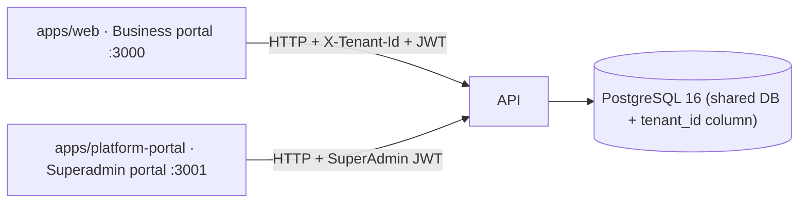
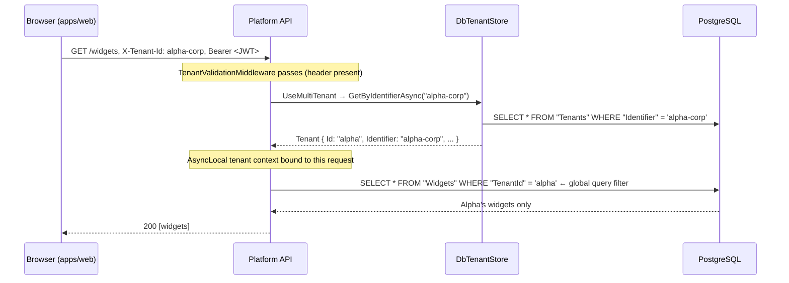
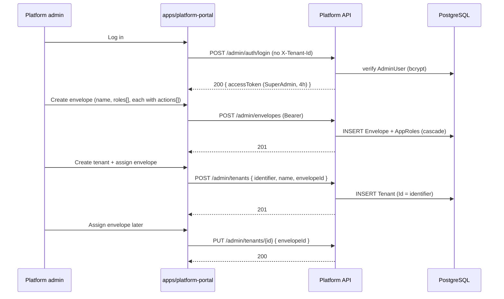
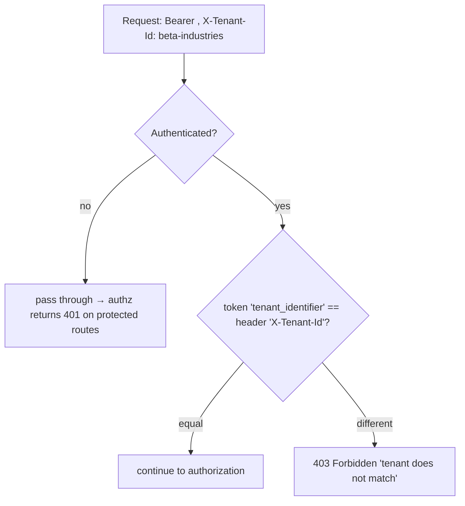
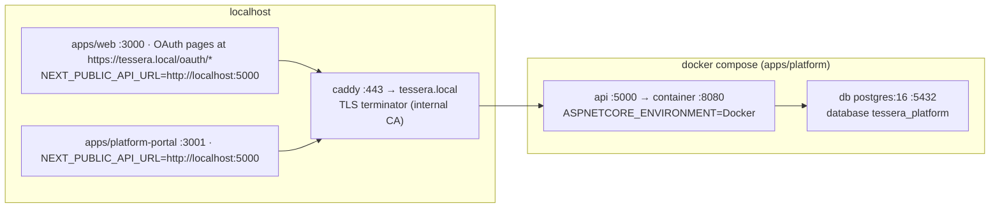

# Tessera Platform Service (`apps/platform`) — Engineering Reference

> **Scope**: the C# ASP.NET Core host that owns auth, tenant context, roles/actions, data, and (now) the MCP OAuth authorization server. For the portals that consume this API, see `docs/web/README.md`. For the MCP gateway + product model, see `docs/mcp/README.md`. For the overall system (index), see `docs/README.md`.

---

## 1. What this service is

A single ASP.NET Core 10 host (`Tessera.Platform.Api`) backed by two class libraries — `Tessera.Platform.Domain` (models + constants, no ASP.NET dependency) and `Tessera.Platform.Observability` (shared `RequestLoggingMiddleware`). It is the system of record for the whole product: auth, authorization, tenant context, roles, actions, manifests, credentials, and (new) the MCP OAuth authorization server.



## 2. Solution layout

```
apps/platform/
├── Dockerfile                              # multi-stage .NET 10 (SDK → publish → aspnet)
├── docker-compose.yml                      # api (:5000→:8080) + db (postgres:16) + caddy (TLS)
├── Guide.md                                # operational run/test guide
├── caddy/Caddyfile                         # local TLS proxy for the OAuth stack
└── src/
    ├── Tessera.Platform.Api/               # host: Program.cs, Endpoints/, Middleware/, Services/, Data/, McpOAuth/, Migrations/
    ├── Tessera.Platform.Domain/            # plain class lib: models + Roles/ActionCatalog constants
    └── Tessera.Platform.Observability/     # class lib: RequestLoggingMiddleware (FrameworkReference to AspNetCore)
```

`Tessera.Platform.Api` is the only ASP.NET project. `Domain` and `Observability` are class libraries.

## 3. Tech stack

| Layer | Tech | Notes |
|---|---|---|
| Runtime | .NET 10 (ASP.NET Core, minimal APIs) | SDK 10.0.302; `net10.0` |
| ORM | EF Core + Npgsql | 10.0.10 / 10.0.0; Postgres by default, InMemory fallback when no connection string |
| Multi-tenancy | Finbuckle.MultiTenant 10.1.2 | header strategy (`X-Tenant-Id`), `DbTenantStore`, `MultiTenantDbContext` |
| Auth (first-party) | JWT Bearer + BCrypt | HS256 symmetric, 15 min access / 7 day refresh for tenants; 4 h for superadmins |
| Auth (MCP OAuth) | OpenIddict 7.7 | authorization code + PKCE, refresh rotation, `/connect/*` endpoints, discovery |
| Logging | Serilog (console) | correlation IDs via `TraceIdentifier` / `Activity.Current.Id` |
| Database | PostgreSQL 16 | `postgres:16-alpine`; single shared DB, `tenant_id` column on tenant-scoped tables |
| Test DB | EF Core InMemory | per-factory isolated store name |

## 4. Multi-tenancy (how a request gets its tenant)

### 4.1 Resolution



- **Store**: `DbTenantStore` (`Data/DbTenantStore.cs`) implements `IMultiTenantStore<Tenant>` against the `Tenants` table. Registered as a singleton. Supersedes the earlier in-memory store so superadmins can add tenants at runtime.
- **DbContext**: `AppDbContext` inherits `MultiTenantDbContext`. Entities marked `.IsMultiTenant()` get a `TenantId` column + a global query filter scoped to the request tenant. On `SaveChanges`, `EnforceMultiTenant` auto-sets `TenantId` on inserts and throws on mismatches.
- **Tenant fields**: `Tenant.Id` is the internal key (e.g. `"alpha"`); `Tenant.Identifier` is the external key sent in `X-Tenant-Id` (e.g. `"alpha-corp"`). They differ for seeded tenants.

### 4.2 Isolation layers

| Layer | Mechanism | Enforced where |
|---|---|---|
| Tenant resolution | `X-Tenant-Id` → `DbTenantStore` → Finbuckle context | `UseMultiTenant()` |
| Data isolation | `IsMultiTenant()` → global query filters + `EnforceMultiTenant` on save | DB queries / saves |
| Token isolation | JWT `tenant_identifier` claim must equal header | `TenantClaimValidationMiddleware` |
| Permission isolation | Actions resolved from `TenantRole` at request time | `ActionChecks` in handlers + `SuperAdminOnly` policy |
| Session freshness | JWT `token_version` must equal user's `TokenVersion` | `TokenVersionValidationMiddleware` |

Always use `FirstOrDefaultAsync` / `ToListAsync` on tenant-scoped queries — never `FindAsync`, which bypasses filters.

### 4.3 Middleware pipeline (exact order)

Order is load-bearing:

```mermaid
flowchart LR
    REQ[HTTP request] --> HTTPS[HttpsRedirection]
    HTTPS --> EX[1. ExceptionHandlingMiddleware]
    EX --> RL[2. RequestLoggingMiddleware]
    RL --> CORS[3. CORS "WebApp"]
    CORS --> RATE[4. RateLimiter "auth"]
    RATE --> TV[5. TenantValidationMiddleware]
    TV --> MT[6. UseMultiTenant]
    MT --> SUS[7. TenantSuspensionMiddleware]
    SUS --> AU[8. UseAuthentication]
    AU --> TC[9. TenantClaimValidationMiddleware]
    TC --> TVM[10. TokenVersionValidationMiddleware]
    TVM --> AZ[11. UseAuthorization]
    AZ --> EP[Endpoint]
```

| # | Middleware | What | Fails with |
|---|---|---|---|
| 0 | `UseHttpsRedirection` | HTTP → HTTPS when configured (no-op over plain http in dev) | — |
| 1 | `ExceptionHandlingMiddleware` | try/catch → `ApiErrorResponse` JSON | 400/404/403/499/500/502/501 |
| 2 | `RequestLoggingMiddleware` | logs method, path, status, duration | — |
| 3 | CORS `WebApp` | origins from `Cors:AllowedOrigins` (defaults localhost:3000/3001) | — |
| 4 | `UseRateLimiter()` | fixed-window per-IP on `/auth/*` (C4) | **429** |
| 5 | `TenantValidationMiddleware` | requires `X-Tenant-Id` on all paths except `/health`, `/ready`, `/openapi`, `/admin`, `/tenants`, `/connect`, `/.well-known` | **400** |
| 6 | `UseMultiTenant()` | Finbuckle resolves tenant + sets context | 500 if store fails |
| 7 | `TenantSuspensionMiddleware` | blocks tenant-scoped requests when `Status == Suspended` (B3) | **403** |
| 8 | `UseAuthentication()` | validates Bearer JWT (issuer, audience, lifetime, HMAC-SHA256, zero clock skew) | **401** |
| 9 | `TenantClaimValidationMiddleware` | compares JWT `tenant_identifier` to header; blocks cross-tenant reuse | **403** |
| 10 | `TokenVersionValidationMiddleware` | compares JWT `token_version` to user's current version (A5) | **401** |
| 11 | `UseAuthorization()` | enforces `SuperAdminOnly` on `/admin/*`; tenant authz is action-based in handlers | **403** |

`/connect` and `/.well-known` are excluded from tenant validation/suspension because on the MCP surface the tenant arrives via the RFC 8707 `resource` parameter, not the header.

### 4.4 Gotchas

1. **`tenant_id` ≠ `tenant_identifier`**. Internal id (`alpha`) vs external identifier (`alpha-corp`). `TenantClaimValidationMiddleware` compares the **identifier** claim against the header. `User.TenantId` stores the **id**.
2. **Widgets are demo data**, not a product feature. They exist to prove Finbuckle's tenant isolation.
3. **`FindAsync` bypasses query filters** — use `FirstOrDefaultAsync`.
4. **`EnforceMultiTenant` needs a tenant context.** Saving `IsMultiTenant` entities with no tenant context throws — that's why tenant-admin/role seeds use raw SQL (Postgres) and why there's no seeded tenant admin on InMemory. Superadmin actions that touch tenant data (envelope copy, tenant delete) use `MultiTenantDbContext.Create` bound to the target tenant.
5. **InMemory limitations**: no raw SQL, no `ExecuteDelete/ExecuteUpdate`, no indexes/constraints. Tenant deletion branches: raw SQL on Postgres, bound-context `MultiTenantDbContext.Create` on InMemory.
6. **`admin@tessera.com` ≠ `superadmin@tessera.com`**. Different tables (`Users` vs `AdminUsers`). The tenant admin only exists on Postgres.
7. **Ports**: `5000` = Docker API · `5085` = local `dotnet run` · `3000` = business portal · `3001` = platform portal · `8000` = MCP gateway · `9100` = Acme Dental stub · `5432` = PostgreSQL · `80/443` = Caddy (the single public origin). Both `.env.local` files currently point to `:5000`.
8. **Middleware order is load-bearing** (see §4.3).
9. **CORS origins are config-driven** — a new frontend port only needs config, not a `Program.cs` change.
10. **Actions are enforced** (`ActionChecks`) for widgets, users, roles, invites, and manifests — no endpoint trusts the role claim alone.
11. **`token_version` stale-token rejection is real.** Password/MFA/role changes and deletion bump it; old JWTs 401. Auth/recovery endpoints are exempt.
12. **Test factories need isolated stores.** `WebApplicationFactory` merges config after `Program`'s top-level code, so provider choice, JWT options, and rate limits must read config lazily. Each factory sets a unique `Database:InMemoryName`.
13. **The `Tenant` entity doubles as the Finbuckle `ITenantInfo`** and a DB row. `ConnectionString` is currently unused (single shared DB).
14. **OAuth dev browser client is `tessera-local-dev`**, pre-registered with loopback redirect `http://127.0.0.1:9876/callback`. Real assistant client registration is **CIMD** and is built (`ClientIdMetadataService`, §6.4).
15. **Local OAuth requires TLS** — Caddy terminates at `https://tessera.local`; the API trusts Caddy's `X-Forwarded-*` so OpenIddict sees `https`. `DisableTransportSecurityRequirement()` is enabled outside Production.

## 5. Authentication & authorization

### 5.1 Two token kinds (first-party, unchanged)

| | Tenant user JWT | Superadmin JWT |
|---|---|---|
| Issued by | `POST /auth/register`, `/auth/login` (+ MFA), `/auth/refresh` | `POST /admin/auth/login` |
| Claims | `sub`, `email`, `role` (name, informational), `role_id`, `token_version`, `tenant_id` (internal), `tenant_identifier` (external), `jti`, `iat` | `sub`, `email`, `role = SuperAdmin`, `jti`, `iat` — **no tenant claims** |
| Lifetime | 15 min (`Jwt:AccessTokenExpirationMinutes`) | 4 h (`Jwt:AdminAccessTokenExpirationHours`) |
| Refresh | Yes — 64 random bytes, 7 days, `RefreshTokens`, family reuse detection (C1) | **No** — portal re-logs on expiry |
| Signing | HMAC-SHA256, symmetric `Jwt:SecretKey` (startup fails if unset — C5) | same |
| Enforced by | `ActionChecks` + `TenantClaimValidationMiddleware` + `TokenVersionValidationMiddleware` | `SuperAdminOnly` policy |

Also: a short-lived **MFA token** (5 min, claim `mfa=true`) after the password step of an MFA-protected login; exchanged at `POST /auth/mfa` for a normal token pair.

Client keeps tokens in `localStorage` (`tessera.auth` for business portal, `tessera.admin` for platform portal) — **not** httpOnly cookies.

### 5.2 Tenant user flow

```mermaid
sequenceDiagram
    participant U as Tenant user
    participant W as apps/web
    participant A as Platform API
    participant DB as PostgreSQL

    U->>W: Click emailed invite link (/register?invite=...&tenant=...)
    W->>A: POST /auth/register + X-Tenant-Id
    A->>DB: invite valid? (email match, unused, unexpired)
    A->>DB: INSERT User (bcrypt; RoleId from invite — first redemption becomes platform-managed Superadmin)
    A->>DB: INSERT RefreshToken (64 bytes, 7d, new FamilyId)
    A-->>W: 201 { accessToken (15m), refreshToken }
    W->>W: save tokens + tenantId to localStorage, redirect /dashboard

    U->>W: Log in
    W->>A: POST /auth/login + X-Tenant-Id
    A->>DB: find user by email (tenant-scoped), bcrypt verify
    alt MFA enabled
        A-->>W: 200 { mfaRequired: true, mfaToken (5m) }
        U->>W: Enter TOTP code
        W->>A: POST /auth/mfa { mfaToken, code }
        A-->>W: 200 { accessToken, refreshToken }
    else
        A-->>W: 200 { accessToken, refreshToken }
    end

    Note over W,A: Any API call returning 401 → POST /auth/refresh (rotates family) → new pair → retry once (lib/api.ts)
```

### 5.3 Superadmin flow



### 5.4 Cross-tenant token attack (blocked)

A valid JWT for tenant A is useless against tenant B: `TenantClaimValidationMiddleware` compares the JWT's **`tenant_identifier`** claim (external name) with the header. It deliberately does **not** compare `tenant_id` (internal id) — that was a real bug fixed previously.



## 6. MCP OAuth authorization server (new — 2026-09)

The platform now also acts as the **OAuth 2.1 authorization server** for MCP. This is a **parallel token universe**: OpenIddict on new `/connect/*` endpoints issues **signed RS256 JWT access tokens** (signed-only, gateway-friendly) plus **encrypted JWT refresh tokens**, with its own EF tables (`OpenIddictDbContext`) that are **not** Finbuckle tenant-filtered. The existing `/auth/*` JWT flow is untouched.

### 6.1 What it provides

- **Authorization endpoint** `GET|POST /connect/authorize` — OpenIddict pass-through; resolves the tenant from the RFC 8707 `resource` param (`https://…/t/{slug}/mcp`), authenticates the user **inside that tenant** (per-tenant `Users` rows, mirroring today's header login), enforces email verification + `token_version`, and redirects to the Next.js portal for login + consent.
- **Token endpoint** `POST /connect/token` — accepts `application/x-www-form-urlencoded` (form-urlencoded is required by the spec; JSON-only parsers would 415); handles authorization-code + PKCE and refresh-token grants; re-issues tokens with current user/tenant state.
- **Interactive login** `POST /connect/login` (+ `/connect/login/mfa`) — JSON endpoints the portal drives; sets the interactive OAuth cookie.
- **Consent** `GET /connect/consent-info` + `POST /connect/consent` (+ `?deny=1` on authorize → `access_denied`) — records user grants in `McpConsents`.
- **Discovery** `/.well-known/openid-configuration` — RFC 8414 + OIDC; advertises `code_challenge_methods_supported: [S256]`, `scopes_supported: [tools, offline_access]`, issuer, endpoints, JWKS. RFC 9207 `iss` in responses. Since 2026-09-12 the payload is also amended (via an OpenIddict `ApplyConfigurationResponseContext` handler) to advertise `client_id_metadata_document_supported: true` and `token_endpoint_auth_methods_supported` including `none` — without that pair, Claude web falls back to a non-CIMD client id and the AS rejects it as `invalid_client`.
- **Pre-registered dev client** `tessera-local-dev` (public, loopback `http://127.0.0.1:9876/callback`) for the scripted PKCE test harness and MCP Inspector.

### 6.2 Tenant binding the OAuth way

On MCP, tenant identity moves from `X-Tenant-Id` to **the URL + token audience**:

- The canonical MCP URL `https://…/t/{slug}/mcp` is the RFC 8707 `resource` the client requests and the token's `aud`. Two tenants ⇒ two distinct audiences ⇒ tokens can't be replayed across tenants.
- The AS maps `resource` → tenant slug at authorize/token time (see `McpOAuthService.TenantSlugFromResource`), then validates the authenticated user belongs to that tenant.
- Access tokens are **signed RS256 JWTs** (JWS, `at+jwt`, kid `mcp-signing-v1`, published at `/.well-known/jwks`) — the AS side is **live** (`options.DisableAccessTokenEncryption()` in `Program.cs`), so the Python gateway needs only the public signing key, never the C# AES key. Refresh tokens are encrypted JWTs (server-side, single-use rotation). The Python gateway's JWKS `TokenVerifier` (signature + audience + expiry + issuer + scopes) is **built and live-verified** (`apps/mcp-server/src/tessera_mcp/auth/token_verifier.py`).
- Scopes: coarse per-tenant `tools` + `offline_access`. Per-tool `required_scopes` from manifests stay aspirational for now — they become enforceable once tokens start carrying them.
- Single issuer for all tenants (default); `aud`/resource distinguishes them.

### 6.3 User model considerations

- Users are **per-tenant rows** (same email can exist in many tenants as separate rows). OAuth login must authenticate **inside the requested tenant** — exactly how the current login works via the tenant header. The `WrongTenantLoginIsRejected` test enforces this.
- Consent is stored per `(UserId, ClientId)` pair (plus denormalized `TenantId`/`TenantIdentifier` for display/revocation). The pair already implies the tenant because users are tenant-scoped.
- Suspended tenants: the handlers refuse authorize/token (and the gateway should 401/403 on stale cached manifests).
- `TokenVersion` invalidation on refresh: the token endpoint re-checks it; stale tokens get `invalid_grant`.

### 6.4 Code map

| File | Role |
|---|---|
| `McpOAuth/McpOAuthConstants.cs` + `McpOAuthConfig` | cookie scheme, claim names, scope `tools`, dev client id/redirect, config readers (issuer/portal/MCP base URL, lifetimes, key directory) |
| `McpOAuth/McpOAuthService.cs` | tenant resolution from `resource`, credential + MFA verification against tenant-scoped `Users`, interactive cookie lifecycle, `BuildTokenIdentity` (RFC 8707 `resource` → `aud`), consent helpers |
| `McpOAuth/McpOAuthEndpoints.cs` | `/connect/authorize`, `/connect/token`, `/connect/login`, `/connect/login/mfa`, `/connect/logout`, `/connect/consent-info`, `/connect/consent` |
| `Data/OpenIddictDbContext.cs` | plain (non-tenant) EF context with `modelBuilder.UseOpenIddict()` |
| `Domain/Models/McpConsent.cs` | user's grant to an MCP client within one tenant (platform-level entity) |
| `Program.cs` | OpenIddict registration (core + server, RS256 signing + AES encryption keys, PKCE required, refresh rotation `SetRefreshTokenReuseLeeway(0)`, `DisableResourceValidation` + ignore audience/resource permissions since tenant endpoints are dynamic), cookie scheme, forwarded-headers trust for Caddy, OAuth paths excluded from tenant middleware, migrations + seeding of dev client, `McpOAuth:KeyDirectory` mounted volume for persistent keys |
| `Middleware/TenantValidationMiddleware.cs` + `TenantSuspensionMiddleware.cs` | `/connect` + `/.well-known` added to exclusion lists |
| `Domain/Models/ToolManifest.cs` + `Data/AppDbContext.cs` | new tenant-scoped `ToolManifests` DbSet + filtered unique index on `(TenantId, ToolName) WHERE NOT IsDeleted` |
| `McpOAuth/ClientIdMetadataService.cs` + `McpOAuth/CimdAuthorizationRequestHandler.cs` | CIMD client registration: fetch/cache the `client_id` metadata document, validate it (https, exact URL match, loopback redirect URIs), and run before OpenIddict's built-in client lookup — rejecting bad documents as `invalid_client`, never a 500 |
| `McpOAuth/McpOAuthKeys.cs` | RS256 signing key (`kid mcp-signing-v1`) + AES encryption key, persisted under `McpOAuth:KeyDirectory` (ephemeral, `Lazy<>`-memoized otherwise) |
| `Data/SampleSmbSeeder.cs` | seeds the Acme Dental tenant + its three tool manifests (idempotent) |

### 6.5 Built since the first drop, and what's still deferred

- ✅ **CIMD client registration** — `ClientIdMetadataService` fetches + caches the client's metadata document, validates the `client_id` (https, path, exact-URL match) and loopback redirect URIs port-agnostically. OpenIddict 7.7 has no CIMD, so it is wired as a `ValidateAuthorizationRequest` handler ordered before the built-in client lookup, plus the discovery amendment described in §6.1.
- **Still deferred:** consent-UI polish, the end-user (Jane) identity model, per-tool scopes, and credential-vault resolution for `vault://` refs (dev resolves them from an env map).
- ✅ **Python gateway `TokenVerifier`** — JWKS fetch/cache with refresh-on-unknown-`kid`, RS256, `iss`, `aud` (= the calling tenant's resource URL) and `exp` validation; missing scope is enforced by the SDK middleware as 403 `insufficient_scope`.

### 6.6 Verified local flow (2026-09-07)

The full PKCE auth-code flow was verified end-to-end through Caddy TLS:

1. Login (`POST /connect/login`) → interactive cookie (`tessera.mcp_oauth`).
2. Consent (`POST /connect/consent`) → grant persisted in `McpConsents`.
3. Authorize (`GET /connect/authorize`) → 302 to loopback callback with `code`.
4. Token exchange (`POST /connect/token`, `authorization_code` + PKCE S256 verifier, `application/x-www-form-urlencoded`) → `{ access_token (signed RS256 JWT), refresh_token (encrypted JWT), token_type: Bearer, expires_in: 900, scope: openid offline_access tools }`.
5. Refresh rotation → new refresh issued, `rotated: True`.
6. Replay of old refresh → `400 invalid_grant` ("already been redeemed").

Access token header confirmed: `alg=RS256`, `typ=at+jwt`, `kid=mcp-signing-v1`, **no `enc` claim** (signed-only — gateway-friendly). JWKS at `/.well-known/jwks` exposes the signing key.

Local build commands used during verification: `docker compose up -d --build api db caddy` (then `cd apps/web && npm run dev` to serve login/consent pages). Seeded test identities: superadmin `superadmin@tessera.com`/`Admin123!` and per-tenant admin `admin@tessera.com`/`Admin123!` (seeded into every tenant incl. `acme-dental` on PostgreSQL only).

### 6.7 Two flows

**Flow 1 — first connect (e.g. Claude Code)**

```
Claude Code --POST /t/acme-dental/mcp--> Gateway   (no token)
Gateway: 401 + WWW-Authenticate: resource_metadata=…PRM
Claude Code --GET PRM--> Gateway /.well-known/oauth-protected-resource/…
Claude Code --GET AS metadata (RFC 8414 + OIDC)--> C# /.well-known/…
Claude Code --GET /connect/authorize?client_id=<CIMD URL>&resource=…t/acme-dental/mcp…--> C#
  1. AS fetches client's CIMD doc → validates redirect URIs  (built)
  2. Login (admin@tessera.com … against acme-dental's Users row; MFA if enabled) via portal
  3. Consent: "Allow <client> to connect to Acme Dental?" → code
Claude Code --POST /connect/token (code + PKCE verifier, form-urlencoded)--> C#
  → { access_token, refresh_token }
Claude Code --POST /t/acme-dental/mcp (Bearer)--> Gateway
  Gateway: validate token → tools/list
```

**Flow 2 — every later call**

```
Client --POST /t/acme-dental/mcp, Authorization: Bearer <token>--> Gateway
  Gateway: verify → resolve tenant from URL → tools/call → HTTP executor → local SMB backend
  401 (expired) → client refreshes proactively (~5 min before expiry) via POST /connect/token
  403 insufficient_scope → re-authorize with step-up (not v1)
```

### 6.8 Local TLS

OAuth requires HTTPS for real clients. Dev stack uses a **Caddy reverse proxy** in compose (`apps/platform/caddy/Caddyfile`) on `https://tessera.local`:

- `/connect/*`, `/.well-known/openid-configuration`, `/.well-known/oauth-authorization-server`, `/.well-known/jwks`, `/auth/*`, `/tenant/*`, `/admin/*`, `/tenants`, `/widgets`, `/health`, `/ready`, `/openapi/*` → platform API container (`api:8080`)
- `/t/*` and `/.well-known/oauth-protected-resource/*` → the Python MCP gateway (`mcp-gateway:8000`) — it **must** share the origin with the AS, because the token audience is the MCP resource URL on that origin
- everything else (`/`, `/oauth/*`, dashboard) → Next.js portal dev server on the host (`host.docker.internal:3000`)

Caddy uses an internal CA. Dev scripts pass `--cacert` from the `caddy-data` volume; browsers accept the dev warning once. The API trusts `X-Forwarded-*` from Caddy so OpenIddict sees `https`. `DisableTransportSecurityRequirement()` is enabled outside Production for local dev/tests.

Two rules make this work, and both cost real debugging time:

- **Endpoint URIs must stay relative.** `SetAuthorizationEndpointUris`, `SetTokenEndpointUris` and `SetJsonWebKeySetEndpointUris` are matched against the *inbound* request, which behind Caddy is always `http://<host>/...`. Absolute `https://` URIs therefore never match, OpenIddict never parses the request, and the passthrough handler throws `InvalidOperationException: The OpenID Connect request cannot be retrieved`.
- **The API must trust `X-Forwarded-Proto`.** TLS ends at the tunnel/edge, so the process only ever sees plain HTTP; `ForwardedHeadersOptions` + `app.UseForwardedHeaders()` (first middleware) plus Caddy's `header_up X-Forwarded-Proto https` (the `(tls_hop)` snippet) are what produce correct public URLs for `issuer`, the authorization/token endpoints and `jwks_uri`.

## 7. Data model — full reference

> 📄 **Table-by-table column/index/FK reference**: see `docs/TABLES.md`.

### 7.1 Platform-level (not tenant-scoped)

| Entity | Table | Notes |
|---|---|---|
| `Tenant` | `Tenants` | PK `Id`; unique `Identifier`; `Name`; `ConnectionString` (unused); `EnvelopeId` FK; `Status` (Active/Suspended); `IsDeleted` (soft); `RowVersion` (xmin); `CreatedAt` |
| `Envelope` | `Envelopes` | template of roles+actions; PK `Id`; unique `Name`; `Description`; `CreatedAt` |
| `AppRole` | `AppRoles` | `EnvelopeId` FK (cascade); unique `(EnvelopeId, Name)`; `Name`; `Actions` (text[]) |
| `AdminUser` | `AdminUsers` | PK `Id`; unique `Email`; `PasswordHash` (bcrypt); `CreatedAt` |

### 7.2 Tenant-scoped (Finbuckle `IsMultiTenant()`)

| Entity | Table | Notes |
|---|---|---|
| `User` | `Users` | PK `Id`; `Email` (indexed, filtered unique on `(Email, TenantId) WHERE NOT IsDeleted`); `PasswordHash`; `RoleId` FK→`TenantRoles` (by convention, no DB FK); `TenantId`; `TokenVersion`; `IsDeleted`; `EmailVerified`; `VerificationToken`; `PasswordResetToken`; `MfaSecret`; `MfaEnabled`; `RowVersion` (xmin); `CreatedAt` |
| `TenantRole` | `TenantRoles` | PK `Id`; `TenantId`; `EnvelopeRoleId` (source AppRole, informational); `Name` (unique per tenant); `Actions` (text[]); `IsSystem`; `RowVersion` (xmin); `CreatedAt` |
| `Widget` | `Widgets` | demo resource; PK `Id`; `TenantId`; `Name`; `Description`; `RowVersion` (xmin); `CreatedAt` |
| `RefreshToken` | `RefreshTokens` | PK `Id`; `UserId` (indexed, by convention no FK); `Token` (64 bytes); `FamilyId` (rotation family); `ExpiresAt` (7d); `IsRevoked`; `TenantId`; `CreatedAt` |
| `Invitation` | `Invitations` | PK `Id`; `TenantId`; `Email`; `RoleId` (FK→TenantRoles by convention); `TokenHash` (SHA-256); `ExpiresAt` (72h); `UsedAt` (single-use); `CreatedAt` |
| `ToolManifest` | `ToolManifests` | new; PK `Id`; `TenantId`; `ToolName` (unique per tenant among active — filtered index `IX_ToolManifests_TenantId_ToolName_OnlyActive`); `Description`; `InputSchema` (JSON text); `Execution` (JSON text); `RequiredScopes`; `RateLimitOverride`; `IsDeleted`; `RowVersion` (xmin); `CreatedAt` |

### 7.3 Platform-level, MCP-specific (new)

| Entity | Table | Notes |
|---|---|---|
| `McpConsent` | `McpConsents` | PK `Id`; `UserId` (tenant-scoped User); `TenantId`; `TenantIdentifier`; `ClientId` (OpenIddict application); `ScopesJson` (e.g. `["tools","offline_access"]`); `GrantedAt`; `RevokedAt` |

### 7.4 OpenIddict store (separate, non-tenant context)

`OpenIddictDbContext` holds OpenIddict's `OpenIddictApplications`, `OpenIddictAuthorizations`, `OpenIddictTokens`, `OpenIddictScopes` — **platform-level**, never Finbuckle-filtered. Migrations: `OpenIddict/20260907104127_AddOpenIddict`.

### 7.5 Deletion rules

- **Delete tenant** → hard-deletes `Widgets`, `RefreshTokens`, `Invitations`; soft-deletes `Users` (`IsDeleted`, `RoleId = null`) and the `Tenant` row. Postgres uses raw SQL (bypasses `EnforceMultiTenant`); InMemory uses a bound `MultiTenantDbContext.Create`.
- **Delete envelope** → first unassigns it from all tenants (`Tenant.EnvelopeId = null`), then deletes the envelope and its roles (cascade). Tenant role copies are untouched.
- **TenantRoles are NOT deleted** on tenant deletion (current behavior — orphan roles remain for deleted tenants; a known gap, see CONCERNS).

### 7.6 Seeds

| Seed | InMemory | PostgreSQL | Source |
|---|---|---|---|
| `Standard` envelope (Admin/Manager/User roles + actions) | ✅ | ✅ | `SeedPlatformDataAsync` (`Program.cs`) |
| Tenants `alpha-corp` (Id `alpha`), `beta-industries` (Id `beta`) | ✅ | ✅ | `SeedPlatformDataAsync` |
| Standard envelope assigned to tenants without one | ✅ | ✅ | `SeedPlatformDataAsync` |
| Superadmin `superadmin@tessera.com` / `Admin123!` (`AdminUsers`) | ✅ | ✅ | `SeedPlatformDataAsync` |
| Tenant admin `admin@tessera.com` / `Admin123!` per tenant (`Users`, Admin role) | ❌ | ✅ | raw SQL in `SeedTenantDataAsync` (Postgres only) |
| Tenant `Superadmin` system role (all actions, `IsSystem`) | ✅ (lazy on first invite) | ✅ | `TenantRoleSeeder.EnsureSuperadmin` + raw SQL / migration backfill |
| `acme-dental` tenant | ✅ | ✅ | `SeedPlatformDataAsync` (idempotent) |
| Acme Dental manifests (book_appointment, cancel_appointment, list_appointments) | ✅ | ✅ | `SampleSmbSeeder.SeedAcmeDentalAsync` |
| MCP dev client `tessera-local-dev` | ✅ | ✅ | `SeedMcpOAuthApplicationsAsync` |

Config: `appsettings.json` (`SeedAdmin`, `SeedSuperAdmin`, `Jwt` issuer/audience/expiries, `Cors:AllowedOrigins`, `RateLimiting:*`, `Database:AutoMigrate`) + `appsettings.Development.json` (dev `Jwt:SecretKey`) + `appsettings.Docker.json` (connection string via env `ConnectionStrings__DefaultConnection`, OAuth env `McpOAuth__*`). Production sets `Jwt__SecretKey` (startup fails fast if unset — C5).

## 8. API surface — complete

All tenant-scoped endpoints require `X-Tenant-Id`. All responses JSON. Errors use `ApiErrorResponse` (see §9).

### 8.1 Platform / first-party endpoints

| Method | Path | Tenant header | Auth | Purpose |
|---|---|---|---|---|
| GET | `/health` | no | public | Liveness: `{ status: "healthy", timestamp }` |
| GET | `/ready` | no | public | Readiness: checks DB (`CanConnectAsync`), 503 when unreachable |
| GET | `/tenants` | no | public | `[{ id: identifier, name }]` for workspace picker (non-deleted only) |
| GET | `/openapi` | no | public | OpenAPI JSON (dev only) |
| POST | `/auth/register` | **yes** | public | Redeem invitation (invite-only): validates emailed token (email match, unused, unexpired), creates user with invite's role. First redemption in a workspace becomes its platform-managed Superadmin. Rate-limited |
| POST | `/auth/login` | **yes** | public | Verify credentials → token pair, or `{ mfaRequired, mfaToken }` when MFA enabled. Generic errors (C3). Rate-limited |
| POST | `/auth/mfa` | **yes** | public | Complete MFA login with TOTP `code` → token pair. Rate-limited |
| POST | `/auth/refresh` | **yes** | public | Rotate refresh token → new pair; replay of a used token revokes the family (C1). Rate-limited |
| POST | `/auth/logout` | **yes** | public | Server-side revoke of the presented refresh token's family. Rate-limited |
| POST | `/auth/change-password` | yes | tenant user | Change password; bumps `token_version`, revokes all sessions |
| POST | `/auth/forgot-password` | **yes** | public | Email a reset link (message-only reply). Rate-limited |
| POST | `/auth/reset-password` | **yes** | public | Set a new password with the emailed token. Rate-limited |
| POST | `/auth/verify-email` | **yes** | public | Verify an email address with the emailed token (C2). Rate-limited |
| POST | `/auth/mfa/enroll` | yes | tenant user | Generate a TOTP secret + otpauth URI |
| POST | `/auth/mfa/verify` | yes | tenant user | Confirm a code → enable MFA (bumps `token_version`) |
| POST | `/auth/mfa/disable` | yes | tenant user | Disable MFA with a current code |
| POST | `/auth/promote` | yes | `manage_users` | Legacy: set a user's role to Admin |
| GET | `/widgets` | yes | `view_widgets` | List tenant's widgets (filtered) |
| GET | `/widgets/{id:guid}` | yes | `view_widgets` | Get one widget |
| POST | `/widgets` | yes | `create_widget` | Create widget |
| PUT | `/widgets/{id:guid}` | yes | `edit_widget` | Update widget |
| DELETE | `/widgets/{id:guid}` | yes | `delete_widget` | Delete widget |
| GET | `/tenant/me` | yes | tenant user | `{ id, email, role, roleId, actions[], tenantId, tenantIdentifier }` — actions resolved live from `RoleId` |
| GET | `/tenant/envelope` | yes | tenant user | The workspace's role set (kept as "envelope" for backward compatibility) |
| GET/POST | `/tenant/roles` | yes | list: any · write: `manage_users` | List / create tenant roles (actions validated against `ActionCatalog`) |
| PUT/DELETE | `/tenant/roles/{id:guid}` | yes | `manage_users` | Update / delete a role; delete blocked while users are assigned (400) |
| GET/POST | `/tenant/invites` | yes | `manage_users` | List / create role-bound invitations (emailed link, 72 h, single-use) |
| GET | `/tenant/users` | yes | `manage_users` | List workspace users (no password hash) |
| POST | `/tenant/users` | yes | `manage_users` | Add user `{ email, password, role }` — role must exist in the tenant's role set |
| PUT | `/tenant/users/{id:guid}` | yes | `manage_users` | Change a user's role (cannot change your own; bumps `token_version`, revokes sessions) |
| DELETE | `/tenant/users/{id:guid}` | yes | `manage_users` | Remove a user (cannot remove yourself; soft delete) |
| POST | `/admin/auth/login` | no | public | Superadmin login → `SuperAdmin` JWT (4 h) |
| GET/POST | `/admin/tenants` | no | `SuperAdminOnly` | List / create tenants (envelope assignment copies template roles into `TenantRoles`) |
| POST | `/admin/tenants/{id}/invites` | no | `SuperAdminOnly` | Send the single workspace Superadmin bootstrap invite; rejected once a live or pending owner exists |
| PUT/DELETE | `/admin/tenants/{id}` | no | `SuperAdminOnly` | Update / delete tenant (delete hard-deletes widgets/tokens/invites, soft-deletes users + tenant) |
| PUT | `/admin/tenants/{id}/status` | no | `SuperAdminOnly` | Suspend / reactivate a tenant (`Active` / `Suspended`) |
| GET/POST | `/admin/envelopes` | no | `SuperAdminOnly` | List / create envelope templates (roles + actions) |
| PUT/DELETE | `/admin/envelopes/{id:guid}` | no | `SuperAdminOnly` | Update / delete envelope (delete unassigns tenants first; tenant role copies untouched) |

### 8.2 MCP tool manifest endpoints (new)

| Method | Path | Tenant header | Auth | Purpose |
|---|---|---|---|---|
| GET | `/tenant/manifests` | yes | `manage_tools` | List active tenant manifests (ordered by `ToolName`) |
| GET | `/tenant/manifests/{id:guid}` | yes | `manage_tools` | Get one manifest |
| POST | `/tenant/manifests` | yes | `manage_tools` | Create manifest (validates tool name, description, inputSchema object, execution object, requiredScopes) |
| PUT | `/tenant/manifests/{id:guid}` | yes | `manage_tools` | Update manifest (concurrency check via `RowVersion`/xmin) |
| DELETE | `/tenant/manifests/{id:guid}` | yes | `manage_tools` | Soft-delete manifest (`IsDeleted = true`) |

These are the **dashboard/management** endpoints, gated by `manage_tools`. The MCP gateway does **not** use them — it resolves tools through the tenant's OAuth-authorized identity (see `docs/mcp/README.md`). The manifest CRUD is the platform's side of the contract; the gateway reads the same `ToolManifests` records through the server-to-server path in §8.3.

Guards worth knowing (return 400 `{ error }`):
- Tenant identifier must match `^[a-z0-9-]+$` and be unique.
- Envelope must have ≥ 1 role; role names unique within the envelope.
- Role names unique per tenant; actions must come from `ActionCatalog`.
- Tool manifest: tool name lowercase letters/digits/underscores only, ≤ 200 chars; description required, ≤ 1000; `inputSchema` and `execution` must be JSON objects; no empty scope strings.
- `POST /tenant/users`: email format, password ≥ 8 chars, role exists in the workspace.

### 8.3 Gateway-facing manifest endpoint (server-to-server)

The Python gateway does **not** use the admin `manage_tools` endpoints. It calls:

| Method | Path | Auth | Purpose |
|---|---|---|---|
| GET | `/internal/gateway/manifests?tenant={slug}` | `X-Gateway-Api-Key` (server-to-server) | The tenant's active manifest catalog that backs `tools/list` / `tools/call`. 404 for an unknown tenant, 403 when the tenant is suspended. |

Tenant identity on this path is the `tenant` query parameter, not `X-Tenant-Id`. The path is excluded from `TenantValidationMiddleware` and `TenantSuspensionMiddleware` so the gateway receives a clean 403 rather than a middleware 400.

## 9. Error contract

Every error response has this shape (`ApiErrorResponse`):

```json
{
  "statusCode": 404,
  "message": "The requested resource was not found.",
  "details": null,
  "traceId": "0HM8K3T6G1V7A",
  "timestamp": "2026-07-27T12:00:00Z"
}
```

- `details` populated with the stack trace **only in Development**.
- `traceId` = `Activity.Current?.Id ?? context.TraceIdentifier` — correlates error ↔ log line.
- Exception → status mapping (`ExceptionHandlingMiddleware.MapException`):

| Exception | HTTP |
|---|---|
| `OperationCanceledException` / `TaskCanceledException` | 499 (client disconnected) |
| `KeyNotFoundException` / `FileNotFoundException` | 404 |
| `ArgumentException` / `InvalidOperationException` | 400 (message echoed) |
| `UnauthorizedAccessException` | 403 |
| `NotImplementedException` | 501 |
| `HttpRequestException` | 502 |
| anything else | 500 |

Note: some endpoint-level errors historically used a different `{ "error": "…" }` shape (e.g. ActionChecks). Standardizing this is a known gap (see CONCERNS).

## 10. Running it

### 10.1 Docker Compose (canonical — PostgreSQL + Caddy TLS)



The OAuth flow requires one TLS origin: Caddy serves `https://tessera.local` — API paths (`/connect/*`, `/.well-known/*`, `/auth/*`, `/tenant/*`, `/admin/*`, `/widgets`, ...) proxy to the platform container; everything else (`/oauth/*`) proxies to the Next.js dev server on the host (`host.docker.internal:3000`), so the `/oauth/*` pages are same-origin with the AS and the OAuth cookie flows. Dashboard API calls still go to `NEXT_PUBLIC_API_URL` (`http://localhost:5000` today).

```
cd apps/platform
docker compose up -d --build    # builds .NET image, starts api + db + caddy
```

Then in two terminals:

```
cd apps/web && npm run dev                  # business portal → http://localhost:3000
cd apps/platform-portal && npm run dev      # platform portal → http://localhost:3001
```

One-time host setup: add `127.0.0.1 tessera.local` to `/etc/hosts` (or `C:\Windows\System32\drivers\etc\hosts`). The full local run steps including TLS trust are in `docs/mcp/README.md` §13.

Env files: `.env.local` in both apps currently sets `NEXT_PUBLIC_API_URL=http://localhost:5000` (the Docker API). The OAuth pages (`/oauth/*`) don't depend on it — they are reached at `https://tessera.local` through Caddy and call `/connect/*` with **relative** URLs (same origin), so the OAuth cookie flows. Without the env files, both apps default to `http://localhost:5085`.

### 10.2 Local without Docker (InMemory fallback)

```
cd apps/platform
dotnet run --project src/Tessera.Platform.Api   # http://localhost:5085
```

With no connection string configured (`appsettings.json` has `""`), the API uses the **EF Core InMemory provider** — data is ephemeral (resets on restart) and behavior differs (see §4.4, §13).

### 10.3 Testing

```
cd apps/platform
dotnet test src/Tessera.Platform.Tests   # 46 tests pass (as of 2026-09-12)
```

| Test class | What | Key scenarios |
|---|---|---|
| `AuthFlowTests` | first-party auth flows | platform invite bootstrapping exactly one Superadmin; registration without invite rejected + generic; refresh rotation + reuse revocation; logout revokes family; change-password revokes all sessions; password reset flow; email verification when enabled; MFA enroll + login flow |
| `McpOAuthTests` | MCP OAuth AS end-to-end | discovery metadata advertises required capabilities (S256, tools, offline_access, issuer, endpoints, JWKS); full authorization-code + PKCE dance (anonymous → redirect to portal login → cookie → consent redirect → portal consent → authorize redirect with code → token exchange → refresh rotation → replay of rotated refresh rejected); wrong-tenant login rejected |
| `ManifestTests` | tool manifest CRUD + authz | Acme Dental sample manifests seeded (book_appointment, cancel_appointment, list_appointments); Admin role includes `manage_tools`; CRUD lifecycle (create → duplicate rejected → list/get → update → soft-delete → name reusable); validation rejects bad payloads (bad name, string schema, array execution, missing name); manifest management requires `manage_tools` (User role forbidden) |
| `GatewayManifestTests` | gateway-facing manifest read | `GET /internal/gateway/manifests` returns the tenant catalog for the correct `X-Gateway-Api-Key`; 404 unknown tenant; 403 suspended tenant; rejects a missing or wrong key |
| `CimdTests` | CIMD client registration | `ClientIdMetadataService` accepts a valid https client_id metadata document and rejects a malformed one; loopback redirect URIs match port-agnostically |

Test factories: `TestAppFactory` (`WebApplicationFactory<Program>`) with per-factory isolated InMemory store name (`Database:InMemoryName`), fixed test signing key, rate limiting off by default, email verification off by default. `RecordingEmailSender` captures emails so tests can extract invite/verification/reset tokens. Helpers in `ApiTestHelpers` (superadmin login, tenant creation, invite redemption, team setup, auth/tenant header helpers).

Note: InMemory cannot validate PostgreSQL-specific behavior (filtered unique indexes, xmin concurrency, raw SQL, transactions, DB constraints). A known gap — see CONCERNS §23.

## 11. Known issues & backlog

| Item | Status |
|---|---|
| Audit trail (who changed which envelope/tenant/role when) | D4 — P2 |
| Envelope versioning | A6 — P2 |
| Subdomain tenant resolution | Only `X-Tenant-Id` header strategy exists (B5) — P2 |
| Superadmin MFA | Tenant MFA done; platform accounts still password only (C6) |
| Backups / PITR | Postgres on Docker volume, no backup story (E6) |
| Observability sink | Correlation IDs exist; no metrics/tracing sink (E5) — Phase 4 |
| CI/CD | No pipeline yet (E2) — Phase 7 |
| Billing | No plans/entitlements; suspension-on-failed-payment can reuse B3 (F1) |
| `NU1903` — `Microsoft.OpenApi` 2.0.0 vuln | Transitive; resolves with SDK/package update |
| Tenant picker reveals tenant names | Public `GET /tenants` — acceptable at this stage, reconsider for real SMBs |
| `/admin/auth/login` not rate-limited | Highest-privilege password gateway — needs its own stricter limiter |
| localStorage token storage | XSS trade-off; consider httpOnly Secure SameSite cookies for production |
| Error contract inconsistency | Some endpoints use `{ "error": "…" }` instead of `ApiErrorResponse` |
| InMemory vs PostgreSQL behavioral gap | Tests pass on InMemory while Postgres behaves differently (filtered indexes, xmin, raw SQL, FKs) |
| Seed credentials dangerous if deployed | `superadmin@tessera.com` / `Admin123!`, `admin@tessera.com` / `Admin123!` — must be impossible to deploy by accident |
| TenantRoles orphaned on tenant deletion | Deletion doesn't clean up `TenantRoles` for deleted tenants |
| First-Superadmin creation race-prone | Application-level check, not a database invariant |
| Role permission changes don't bump token_version | Live-action model means it's fine, but semantically inconsistent (CONCERNS §2) |
| Tenant identifier changes invalidate all sessions | `X-Tenant-Id` header breaks against JWT's old `tenant_identifier` claim |
| No DB foreign keys on tenant-scoped relationships | Logical relationships (`User→TenantRole`, `RefreshToken→User`, `Invitation→TenantRole`) not DB-enforced |
| Tenant deletion not fully atomic | Multiple operations; should be one transaction |
| Invitation lifecycle under-specified | No revocation; multiple outstanding invites for same email allowed |
| MFA threat-modeling gaps | No per-account MFA attempt throttling; secret lifecycle on abandoned enrollment; MFA disable doesn't require password/recovery factor |
| MCP authorization boundary for tool execution | End-user tool authz (Jane) is a separate plane from workspace RBAC — not yet designed |
| Manifest versioning vs authorization versioning | What happens to cached tools / issued tokens / consent when a manifest changes |

## 12. Recorded decisions

- **Multitenancy**: shared DB + `tenant_id` column via Finbuckle.MultiTenant.
- **Auth**: roll-our-own JWT (bcrypt + access/refresh tokens) — swap to WorkOS/Auth0 possible later.
- **Cloud target**: Fly.io (not yet deployed; `fly.toml` doesn't exist).
- **Solution structure**: one service, three class libraries by concern (Api / Domain / Observability).
- **Logging**: Serilog, console sink.
- **Exceptions**: global middleware (not `IExceptionHandler`).
- **Monorepo**: all apps + platform in one repo.
- **Tenant onboarding**: invite-only. Platform sends one workspace-owner bootstrap invite; that invite redeems into the platform-managed Superadmin role. Superadmin creates Admins, who invite members.
- **Actions**: enforced server-side via `ActionChecks`; envelope is a template copied into tenant-owned roles (no cascade).
- **MCP stack**: C# = system of record; Python = thin MCP gateway (protocol adapter only, no business logic, no direct DB access); Next.js = admin dashboard + end-user login/consent pages.
- **MCP tool manifests**: `ToolManifests` is a tenant-scoped `IsMultiTenant()` entity; slot into existing action-based authz as `manage_tools`.
- **MCP tenant addressing**: path-based v1 (`https://…/t/{tenant-slug}/mcp`).
- **MCP OAuth AS**: OpenIddict 7.7 inside the C# host (build it ourselves — no hosted-AS fallback). Login/consent pages live in the Next.js portal. Access tokens are signed RS256 JWTs (JWS, `at+jwt`, kid `mcp-signing-v1`) validated by the Python gateway via `/.well-known/jwks`. This is live — `options.DisableAccessTokenEncryption()` in `Program.cs` makes the AS issue signed-only JWTs while keeping the encryption key for refresh tokens.
- **MCP OAuth scopes**: coarse per-tenant `tools` + `offline_access` for v1.
- **MCP credential vault**: v1 encrypted-at-rest DB columns (AES-GCM, env-var master key); KMS later.
- **MCP gateway repo home**: `apps/mcp-server` (not `services/mcp-gateway` as earlier docs said).
- **MCP local TLS**: Caddy reverse proxy in compose on `https://tessera.local`.
- **MCP auth sequencing**: build gateway with auth seams from day one (stub token verifier); do OAuth spike early; don't build hosted-assistant connectivity (ChatGPT) until Business/Edu plan + public HTTPS.

## 13. Where to go next

See `docs/mcp/README.md` for the MCP product model, manifest contract, gateway design, OAuth AS requirements, R&D findings, the Acme Dental sample SMB, and the local run guide. For the overall system (index), see `docs/README.md`. Backlog/phases are tracked in `project-management/`.
