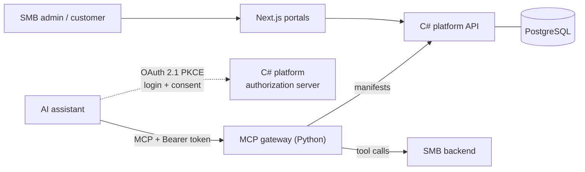

# Tessera

**Plug-and-play MCP integration for SMBs.** An SMB configures its tools once as
a **tool manifest**; a generic, hosted MCP server exposes those tools to AI
assistants (Claude, ChatGPT, …) so *their* customers can operate the SMB's
services from chat — no MCP server code ever written by the SMB.

Stack: **C#** (platform: system of record — data, authz, manifests, OAuth
authorization server) · **Python** (thin MCP gateway — protocol adapter only) ·
**Next.js** (admin dashboards + end-user OAuth login/consent pages) ·
**PostgreSQL** · **Caddy + cloudflared** for local TLS/public reachability.

---

## Status

| Piece | State |
|---|---|
| Multi-tenant platform (auth, invite-only onboarding, roles/actions, tenants, envelopes) | ✅ Working |
| MCP tool manifests (CRUD + seeded Acme Dental fixture) | ✅ Working |
| MCP OAuth authorization server (OpenIddict, PKCE, CIMD, JWKS) | ✅ Working |
| Python MCP gateway (`tools/list`, `tools/call`, RFC 9728 PRM, per-tenant token binding) | ✅ Working |
| Local Acme Dental backend stub | ✅ Working |
| **Claude web end-to-end** (connector → login/consent → book/list/cancel appointments) | ✅ **Live-verified 2026-09-12** |
| Docker + Caddy + tunnel orchestration | ✅ Working |
| End-user (Jane) identity, per-tool scopes, credential vault, CI/CD, deployment | ⛔ Not built — see `docs/mcp/README.md` §5 |

Test suites: **C# 46/46**, **Python 39/39**.

---

## Repository layout

```
Tessera/
├── apps/
│   ├── web/                  # Next.js business portal (:3000) + /oauth/* login & consent
│   ├── platform-portal/      # Next.js superadmin portal (:3001)
│   ├── platform/             # C# platform service (Api · Domain · Observability · Tests)
│   └── mcp-server/           # Python MCP gateway + Acme Dental stub backend
├── docs/                     # all documentation (start at docs/README.md)
├── project-management/       # roadmap · tasks · decisions · learning-log · progress
├── scripts/                  # start-claude-web.sh — one-command live stack
└── infra/                    # placeholder for cloud provisioning
```

## Documentation

| Doc | What it covers |
|---|---|
| [`docs/FLOW.md`](docs/FLOW.md) | **End-to-end Mermaid diagrams** of the whole system, module by module |
| [`docs/README.md`](docs/README.md) | Architecture index — the single source of truth for how it fits together |
| [`docs/platform/README.md`](docs/platform/README.md) | C# platform service (auth, data, middleware, endpoints, OAuth AS) |
| [`docs/mcp/README.md`](docs/mcp/README.md) | MCP product model, manifest contract, gateway design, auth contract |
| [`docs/web/README.md`](docs/web/README.md) | The two Next.js portals and the OAuth pages |
| [`docs/LIVE_TESTING_GUIDE.md`](docs/LIVE_TESTING_GUIDE.md) | How to wire the gateway to a real AI assistant and test it live |
| [`docs/TABLES.md`](docs/TABLES.md) | Database schema reference |
| [`docs/CONCERNS.md`](docs/CONCERNS.md) | Concerns register — known gaps, races, and deferred decisions |
| [`docs/USER_JOURNEYS.md`](docs/USER_JOURNEYS.md) | Journey flowcharts for the three dashboard actors |
| [`docs/CODE_DRY_RUN.md`](docs/CODE_DRY_RUN.md) | Historical line-by-line dry run of the pre-MCP codebase |
| [`docs/progress.md`](docs/progress.md) | Build log for the MCP gateway session |
| [`apps/platform/Guide.md`](apps/platform/Guide.md) | Operational guide for the platform service |

---

## Run it

### The full live stack (Claude web / any hosted assistant)

One command brings up the tunnel, the dockerized stack (API, MCP gateway, stub
backend, Caddy, PostgreSQL) and the Next.js portal, then verifies the whole OAuth
surface before printing the connector URL:

```bash
./scripts/start-claude-web.sh          # prints: <tunnel>/t/acme-dental/mcp
./scripts/start-claude-web.sh --stop   # tears everything down
```

Then in **claude.ai → Settings → Connectors → Add custom connector**:

- URL: `<printed URL>/t/acme-dental/mcp`
- Auth: **Sign in now (Detected)**
- OAuth client: **Use Claude's published identity (Recommended)**

Sign in as `admin@tessera.com` / `Admin123!` (per-tenant admin — PostgreSQL
only) and approve the consent screen.

### The dashboards only (no OAuth)

```bash
cd apps/platform && docker compose up -d --build api db caddy
cd apps/web && npm run dev                 # → http://localhost:3000
cd apps/platform-portal && npm run dev     # → http://localhost:3001
```

### The platform without Docker (ephemeral InMemory DB)

```bash
cd apps/platform
dotnet run --project src/Tessera.Platform.Api --no-launch-profile
# → http://localhost:5085  (ASPNETCORE_URLS is ignored without --no-launch-profile)
```

Seeded identities: superadmin `superadmin@tessera.com` / `Admin123!` (both
providers) and per-tenant admin `admin@tessera.com` / `Admin123!` (PostgreSQL
only). **Development credentials — never deploy them.**

---

## Test it

```bash
# C# platform — 46 tests
cd apps/platform && dotnet test src/Tessera.Platform.Tests

# Python MCP gateway — 39 tests
cd apps/mcp-server && uv run pytest -q
```

Requires the .NET 10 SDK (`net10.0`) and Python 3.13 with
[`uv`](https://docs.astral.sh/uv/).

---

## How the pieces fit (30-second version)



The C# platform is the **system of record**; the gateway never touches the
database. Adding a tool for a tenant is a manifest row, not a deployment. Full
diagrams in [`docs/FLOW.md`](docs/FLOW.md).
